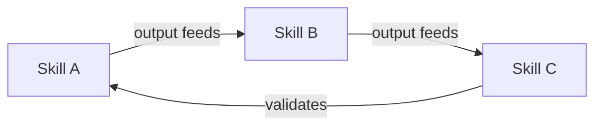
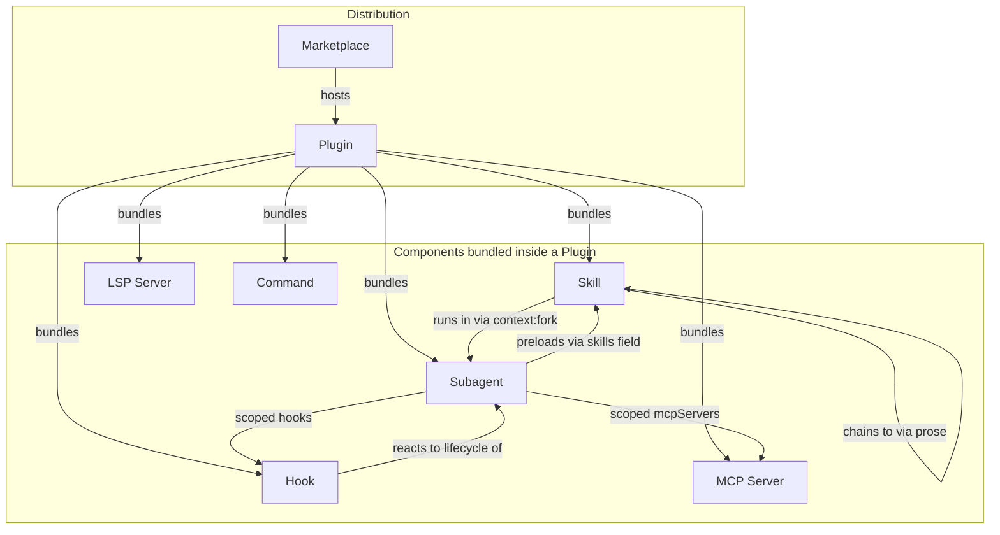
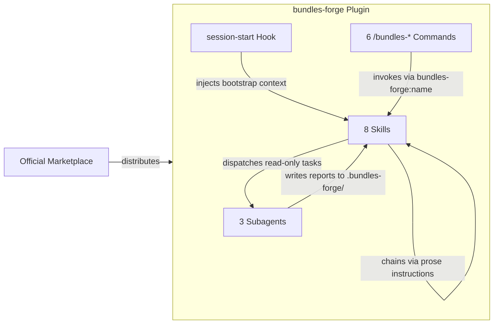
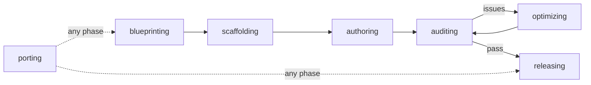
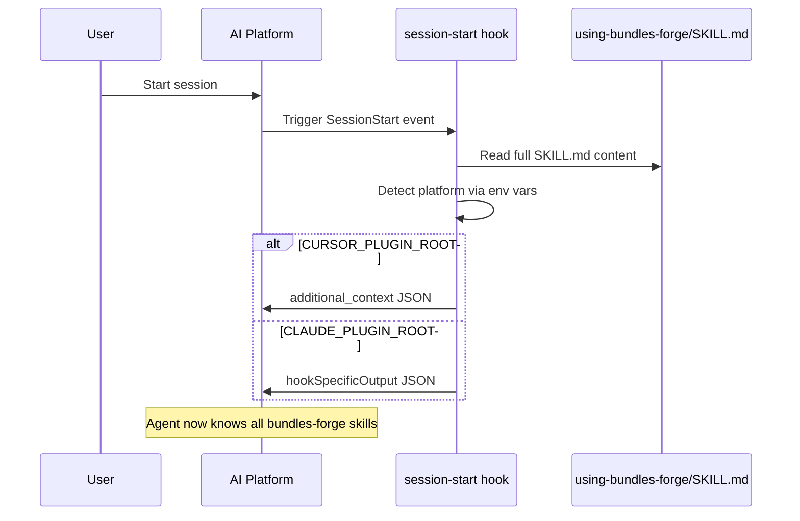
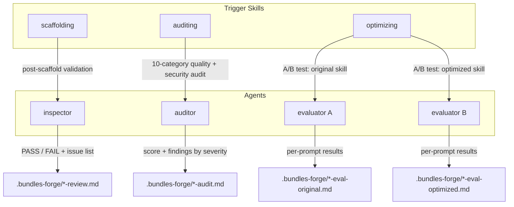
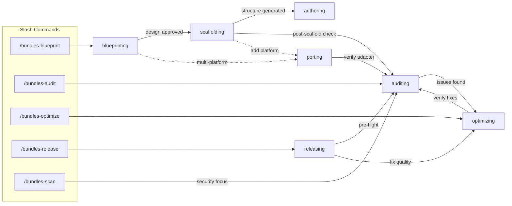

# Bundles Forge

[中文](README.zh.md)

A toolkit for building **bundle-plugins** — AI coding plugins organized around collaborative skill workflows — across Claude Code, Cursor, Codex, OpenCode, and Gemini CLI.

## What is a Bundle-Plugin?

A single skill (`SKILL.md`) does one thing — an AI agent discovers it by its `description` field and loads it on demand. A **bundle-plugin** takes this further: multiple skills reference each other and form a workflow, where one skill's output feeds the next.



bundles-forge itself is a bundle-plugin — `blueprinting` produces a design, `scaffolding` generates a project from it, `auditing` validates the result, and `optimizing` iterates on issues found.

**If your plugin has 3+ skills that form a workflow, you're building a bundle-plugin.** This toolkit gives you scaffolding, quality gates, and multi-platform publishing for that pattern.

## Quick Start

### Install (Claude Code)

```bash
claude plugin install bundles-forge
```

For development (any platform):

```bash
git clone https://github.com/odradekai/bundles-forge.git
cd bundles-forge
claude plugin link .
```

> Other platforms: see [Platform Support](#platform-support) below.

### Path A: Build a New Bundle-Plugin

```
/bundles-blueprint
```

This starts a structured interview to design your project — scope, platform targets, skill decomposition. When the design is ready, the agent automatically chains into `scaffolding` (project generation) and then `authoring` (SKILL.md writing).

### Path B: Audit an Existing Project

```
cd your-bundle-plugin-project
/bundles-audit
```

Runs a 10-category quality assessment with security scanning across 5 attack surfaces.

## Key Concepts

The [Claude Code plugin ecosystem](https://code.claude.com/docs/en/plugins) comprises several building blocks that work together. Understanding these concepts helps you see how bundles-forge's skills, agents, and hooks fit into the bigger picture.



### Core Concepts

**[Skill](https://code.claude.com/docs/en/skills)** — The atomic capability unit. A `SKILL.md` file with YAML frontmatter (`name`, `description`, `allowed-tools`, etc.) that the agent discovers by its `description` and loads on demand. Skills can run inline in the main conversation or in an isolated subagent via `context: fork`. Skills chain to each other through prose instructions, not code APIs.

> **In bundles-forge:** 8 skills form a lifecycle workflow — each skill's instructions tell the agent which skill to invoke next using the `bundles-forge:<name>` convention. See [How Skills Chain](#how-skills-chain).

**[Plugin](https://code.claude.com/docs/en/plugins)** — The packaging and distribution unit. A directory containing `.claude-plugin/plugin.json` (manifest) plus any combination of skills, agents, hooks, MCP servers, LSP servers, commands, and output styles. Plugins namespace their components (`/plugin-name:skill-name`) to avoid conflicts. Distributed via marketplaces.

> **In bundles-forge:** The project itself is a plugin with manifests for 5 platforms. It's also a toolkit for *building* other plugins — a bundle-plugin that builds bundle-plugins.

**[Subagent](https://code.claude.com/docs/en/sub-agents)** — A specialized AI assistant running in its own context window with a custom system prompt, tool restrictions, and model selection. The main conversation delegates tasks to a subagent and receives only a summary back. Built-in subagents include Explore (read-only, fast), Plan (research for planning), and general-purpose (full tools). Custom subagents are defined as Markdown files in `agents/`.

> **In bundles-forge:** Three read-only subagents — `inspector`, `auditor`, `evaluator` — are dispatched by skills for isolated validation work. See [Agent Dispatch](#agent-dispatch).
>
> **Design decision:** Users always interact through skills (slash commands), never by invoking agents directly. Skills orchestrate agent dispatch from the main conversation because they need pre/post logic (scope detection, report merging). Subagents cannot spawn other subagents — all orchestration stays in the skill layer.

**[Hook](https://code.claude.com/docs/en/hooks)** — A shell command, HTTP endpoint, or LLM prompt that executes automatically at specific lifecycle events (`SessionStart`, `PreToolUse`, `PostToolUse`, `Stop`, `SubagentStart`, etc.). Hooks can block operations, inject context, or trigger side effects. Defined in `hooks/hooks.json` or settings.

> **In bundles-forge:** The `session-start` hook reads the bootstrap skill and injects it into the agent's context, giving it awareness of all available skills at the start of every session. See [Session Bootstrap](#session-bootstrap).

**[MCP (Model Context Protocol)](https://code.claude.com/docs/en/mcp)** — An open standard for connecting Claude to external tools and data sources (databases, APIs, issue trackers). MCP servers are configured via `.mcp.json` and provide tools, resources, and prompts. Plugins can bundle MCP servers that start automatically when the plugin is enabled.

> **In bundles-forge:** The toolkit doesn't ship its own MCP server, but the `auditing` skill checks target projects for MCP configuration security issues across 5 attack surfaces.

### Supplementary Concepts

**[Command](https://code.claude.com/docs/en/skills)** — Slash commands (`/deploy`, `/audit`) that invoke skills. Commands have been merged into the skill system — a file at `.claude/commands/deploy.md` and a skill at `.claude/skills/deploy/SKILL.md` create the same `/deploy` command. Plugin `commands/` directories are still supported.

> **In bundles-forge:** 6 `/bundles-*` commands serve as thin entry points that redirect to the corresponding skill. See [Command Execution](#command-execution).

**[Marketplace](https://code.claude.com/docs/en/discover-plugins)** — A plugin catalog that hosts installable plugins. Supports GitHub repos, Git URLs, local paths, and remote URLs. The official Anthropic marketplace is available by default; teams can create private marketplaces.

> **In bundles-forge:** Distributed through the official Anthropic marketplace (`claude plugin install bundles-forge`).

**[LSP Server](https://code.claude.com/docs/en/plugins-reference#lsp-servers)** — Language Server Protocol integration that gives Claude real-time code intelligence: diagnostics after edits, go-to-definition, find-references, and hover information. Configured via `.lsp.json` in the plugin.

> **In bundles-forge:** Not used — the toolkit focuses on skill/plugin engineering rather than language-specific code intelligence.

**[Output Style](https://code.claude.com/docs/en/plugins-reference#plugin-directory-structure)** — Custom response formatting directives stored in `output-styles/` that change how Claude presents its output.

> **In bundles-forge:** Not used.

### How They Work Together in bundles-forge



## Skills

The 8 skills cover the full lifecycle of a bundle-plugin project:



| Phase | Skill | What It Does |
|-------|-------|-------------|
| Design | `blueprinting` | Structured interview to determine project scope, platform targets, and skill decomposition. Produces a design document. |
| Scaffold | `scaffolding` | Generates the complete project structure from the design — manifests, hooks, scripts, bootstrap skill, and per-platform files. |
| Write | `authoring` | Guides SKILL.md authoring — frontmatter, "Use when..." descriptions, instructions, and progressive disclosure via `references/`. |
| Audit | `auditing` | 10-category quality assessment including security scanning across 5 attack surfaces. |
| Optimize | `optimizing` | Engineering improvements — description triggering accuracy, token efficiency, workflow chains, and feedback iteration. |
| Adapt | `porting` | Adds or fixes platform support. Generates manifests from templates. |
| Release | `releasing` | Orchestrates the pre-release pipeline: version drift check, audit, documentation consistency, change coherence review, version bump, CHANGELOG update, and publish guidance. |

The bootstrap meta-skill `using-bundles-forge` is injected at session start via hooks — it gives the agent awareness of all available skills and routes tasks automatically.

**Standalone use:** `authoring`, `auditing`, and `optimizing` can be invoked independently on any existing project without going through the full lifecycle.

### Agents

| Agent | Role |
|-------|------|
| `inspector` | Validates scaffolded project structure |
| `auditor` | Executes systematic quality audit with security scanning |
| `evaluator` | Runs one side of an A/B skill evaluation for optimization |

### Commands

| Command | Skill |
|---------|-------|
| `/bundles-forge` | `using-bundles-forge` |
| `/bundles-blueprint` | `blueprinting` |
| `/bundles-audit` | `auditing` |
| `/bundles-optimize` | `optimizing` |
| `/bundles-release` | `releasing` |
| `/bundles-scan` | `auditing` |

Skills without a slash command are invoked **automatically** (the agent matches user intent to the skill's `description` field) or **explicitly** when another skill chains to them via `bundles-forge:<skill-name>` references.

## Auditing

Four audit scopes for different levels of granularity — the agent auto-detects scope from the target path:

| Scope | Command / Script | What It Checks |
|-------|-----------------|----------------|
| Full Project | `/bundles-audit` or `audit_project.py` | 10 categories (structure, manifests, version sync, skill quality, cross-refs, workflow, hooks, testing, docs, security) |
| Single Skill | `/bundles-audit skills/authoring` or `audit_skill.py` | 4 categories (structure, skill quality, cross-refs, security) |
| Workflow | Explicit request or `audit_workflow.py` | 3 layers: static structure, semantic interface, behavioral verification (W1-W12) |
| Security Only | `/bundles-scan` or `scan_security.py` | 5 attack surfaces (skill content, hooks, plugins, agents, scripts) |

### Quick Start (Scripts)

```bash
python scripts/audit_project.py .                                      # full project audit
python scripts/audit_skill.py skills/authoring                         # single skill audit
python scripts/audit_workflow.py .                                     # workflow audit
python scripts/audit_workflow.py --focus-skills new-skill .            # focused workflow audit
python scripts/scan_security.py .                                      # security-only scan
```

Exit codes: `0` = pass, `1` = warnings, `2` = critical findings. All scripts accept `--json` for CI integration.

**After the audit:** Critical findings → fix or invoke `bundles-forge:optimizing`. Ready to publish → invoke `bundles-forge:releasing`.

> For detailed usage, checklists, report templates, and CI integration patterns, see [`docs/auditing-guide.md`](docs/auditing-guide.md).

## Architecture

<details>
<summary>Session bootstrap and skill routing internals</summary>

### Session Bootstrap

When a session starts, the `session-start` hook reads `using-bundles-forge/SKILL.md` and injects it into the agent's context. This gives the agent the full skill inventory and routing logic.



### Skill Routing

Once the bootstrap context is loaded, the agent routes requests through three paths:

1. **Slash commands** — `/bundles-blueprint`, `/bundles-audit`, etc. Each command file redirects to a skill via `bundles-forge:<skill-name>`.
2. **Explicit references** — Other skills or the user directly reference `bundles-forge:<skill-name>`. The agent uses the platform's skill-loading tool.
3. **Description matching** — The agent matches user intent against each skill's `description` field (which starts with "Use when...") and invokes the best match.

### How Skills Chain

Skills chain through **prose instructions**, not code APIs. When a skill finishes, it tells the agent which skill to invoke next using the `project:skill-name` convention. The host platform handles the actual loading:

| Platform | Skill Loading Tool |
|----------|-------------------|
| Claude Code | `Skill` tool |
| Cursor | `Skill` tool |
| Gemini CLI | `activate_skill` tool |
| Codex | Filesystem discovery from `~/.agents/skills/` |
| OpenCode | `use_skill` via plugin transform |

### Agent Dispatch

Three specialized agents handle tasks that benefit from isolated, read-only execution. They are dispatched as **subagents** — only when the host platform supports subagent dispatch. If subagents are unavailable, the main agent performs the same work inline.

All agents share two constraints: `disallowedTools: Edit` (cannot modify project files) and reports are saved to `.bundles-forge/`.



| Agent | Dispatched By | When | What It Does | Output |
|-------|--------------|------|-------------|--------|
| `inspector` | `scaffolding` | After project structure is generated | Validates directories, manifests, version sync, hooks, and skill frontmatter conventions | PASS/FAIL with issues by severity |
| `auditor` | `auditing` | During a full or skill-scoped audit | Runs 10-category checklist (structure, manifests, version sync, quality, cross-refs, workflow, hooks, testing, docs, security) | Weighted score + critical/warning/info findings |
| `evaluator` | `optimizing` | During description A/B test or feedback A/B test | Runs test prompts against a single SKILL.md variant (labelled `original` or `optimized`) and records whether each prompt triggers the skill correctly | Per-prompt trigger/response report |

**Key detail:** `optimizing` dispatches **two evaluators in parallel** — one for the original skill, one for the optimized variant. The parent skill compares their reports to decide which version wins.

### Command Execution

Each slash command is a thin pointer to a skill. The real logic lives in the skill — but the execution chains can be deep.



#### `/bundles-blueprint` — Plan a new bundle-plugin

**When to use:** Starting a new project, splitting a monolithic skill into multiple skills, or composing third-party skills into a bundle.

```
User runs /bundles-blueprint
  → blueprinting: structured interview (scope, platforms, skill decomposition)
  → User approves design document
  → scaffolding: generate project structure, manifests, hooks, scripts
    → inspector agent validates scaffold (if subagents available)
  → authoring: guide SKILL.md content for each skill
  → porting: add platform adapters (if multi-platform)
```

#### `/bundles-audit` — Quality assessment

**When to use:** Reviewing a project before release, after significant changes, or when scanning a third-party skill for security risks.

```
User runs /bundles-audit
  → auditing: detect scope (full project vs single skill vs workflow)
  → Full project: 10 categories (structure, manifests, version sync,
    quality, cross-refs, workflow, hooks, testing, docs, security)
    → auditor agent runs checklist (if subagents available)
    → Scripts: audit_project.py, audit_workflow.py, scan_security.py, lint_skills.py
  → Single skill: 4 categories (structure, quality, cross-refs, security)
  → Workflow: 3 layers (static structure, semantic interface, behavioral)
  → Score + report with Critical / Warning / Info findings
  → Critical issues? → Offer to fix → Re-audit once
  → Warnings? → Suggest optimizing skill
```

#### `/bundles-scan` — Security-focused audit

**When to use:** Same as `/bundles-audit` but emphasizes security scanning. Maps to the same `auditing` skill — the 5-surface security scan (SKILL.md content, hook scripts, plugin code, agent prompts, bundled scripts) runs as Category 9.

#### `/bundles-optimize` — Engineering improvements

**When to use:** Improving description triggering accuracy, reducing token usage, fixing workflow chain gaps, or iterating on user feedback about a specific skill.

```
User runs /bundles-optimize
  → optimizing: detect scope (project vs single skill)
  → Project scope: 6 optimization targets
    (descriptions, tokens, progressive disclosure, workflow chain,
     platform coverage, security remediation)
  → Skill scope: targeted optimization + feedback iteration
  → Description A/B test:
    → 2x evaluator agents in parallel (if subagents available)
    → Compare reports → pick winner
  → Verify fixes via auditing
```

#### `/bundles-release` — Version bump and publish

**When to use:** Preparing a release — version drift check, quality gate, documentation consistency, version bump, CHANGELOG update, and publishing guidance.

```
User runs /bundles-release
  → releasing: pre-flight checks
    → bump_version.py --check (version drift)
    → auditing (full quality + security)
    → check_docs.py (documentation consistency)
  → Address critical findings (block release until resolved)
  → Documentation sync (change coherence review + doc updates)
  → bump_version.py <new-version> (update all manifests)
  → Update CHANGELOG.md and README.md
  → Final verification (--check + --audit + check_docs.py)
  → Commit, tag, push, gh release create
```

</details>

## Platform Support

### Cursor

Search for `bundles-forge` in the Cursor plugin marketplace, or use `/add-plugin bundles-forge`.

### Codex

See [`.codex/INSTALL.md`](.codex/INSTALL.md)

### OpenCode

See [`.opencode/INSTALL.md`](.opencode/INSTALL.md)

### Gemini CLI

```bash
gemini extensions install https://github.com/odradekai/bundles-forge.git
```

## Tips for Long Sessions

Skills, audit reports, and script output accumulate in the conversation context over a long session. If you notice the agent slowing down or losing track of earlier context:

- **Start a fresh session** for each major lifecycle phase (blueprinting, authoring, auditing)
- **Use slash commands** (`/bundles-audit`, `/bundles-optimize`) to re-anchor the agent on the current task
- **Prefer script output over inline checks** — `python scripts/audit_project.py .` produces a compact summary instead of the agent reasoning through each check

## Contributing

Contributions welcome. Please follow the existing code style and ensure all platform manifests stay in sync using `python scripts/bump_version.py --check`.

## License

Apache-2.0
