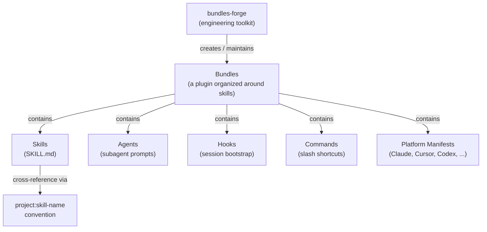
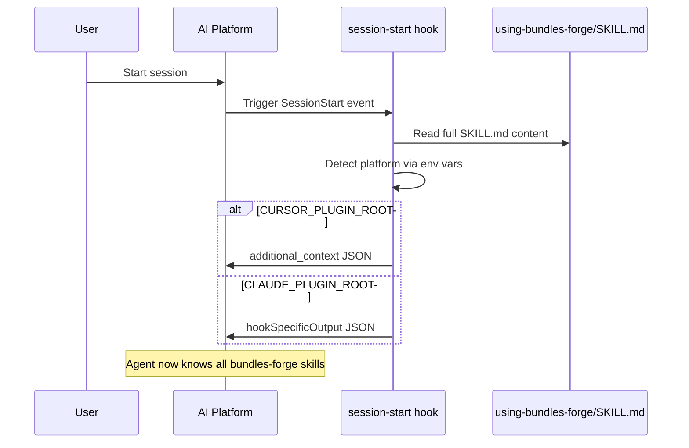
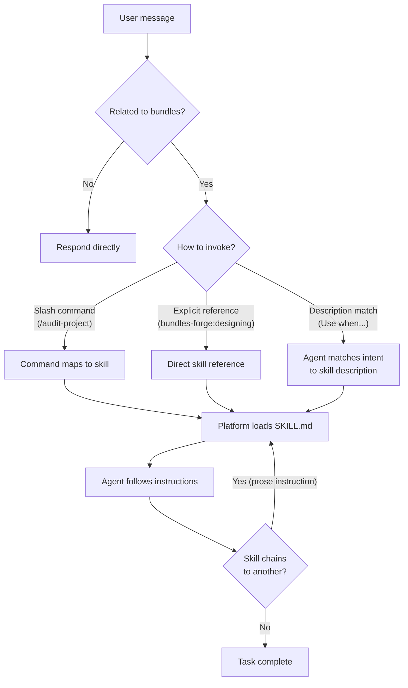
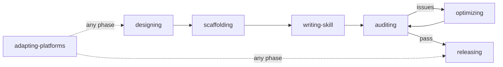

# Bundles Forge

[中文](README.zh.md)

A bundles engineering toolkit: scaffolding, platform adaptation, version management, auditing, and skill lifecycle management across 5 AI coding platforms.

## Installation

### Claude Code

```bash
claude plugin install bundles-forge
```

Or for development:

```bash
git clone https://github.com/odradekai/bundles-forge.git
cd bundles-forge
claude plugin link .
```

### Cursor

Search for `bundles-forge` in the Cursor plugin marketplace, or use `/add-plugin bundles-forge`.

### Codex

See [`.codex/INSTALL.md`](.codex/INSTALL.md)

### OpenCode

See [`.opencode/INSTALL.md`](.opencode/INSTALL.md)

### Gemini CLI

```bash
gemini extensions install https://github.com/odradekai/bundles-forge.git
```

## Core Concepts



| Term | Definition |
|------|-----------|
| **Skill** | The atomic unit of capability — a `SKILL.md` file (with optional `references/`) that an AI agent discovers through its `description` field and loads on demand. |
| **Plugin** | The distribution format for AI coding platforms. A plugin can contain skills, agents, commands, hooks, MCP servers, and other components. |
| **Bundles** | A plugin organized primarily around a **collection of collaborative skills** — skills that reference each other and form workflows. This is a naming convention used in this project, not an official platform term. |
| **bundles-forge** | An engineering toolkit (itself a bundles plugin) for creating, auditing, optimizing, and releasing bundles projects across 5 platforms. |

### Why Bundles?

A regular plugin might have one skill doing one thing. A **bundles** project has skills that _collaborate_: skill A produces output that skill B consumes, skill C validates what A and B created. bundles-forge itself is a bundles — `designing` feeds into `scaffolding`, which triggers `auditing`, which may call `optimizing`.

If your plugin has 3+ skills that form a workflow, you're building a bundles. This toolkit gives you scaffolding, quality gates, and multi-platform publishing for that pattern.

### How Skills Invoke Each Other

Skills chain through **prose instructions**, not code APIs. When a skill finishes, it tells the agent (in plain text) which skill to invoke next using the `project:skill-name` convention. The host platform's skill-loading tool does the actual loading:

| Platform | Tool |
|----------|------|
| Claude Code | `Skill` tool |
| Cursor | `Skill` tool |
| Gemini CLI | `activate_skill` tool |
| Codex | Filesystem discovery from `~/.agents/skills/` |
| OpenCode | `use_skill` via plugin transform |

## How It Works

### Session Bootstrap

When a session starts, the `session-start` hook reads the full content of `using-bundles-forge/SKILL.md` (the bootstrap meta-skill) and injects it into the agent's context. This gives the agent awareness of all available skills and how to route tasks.



### Skill Routing

Once the bootstrap context is loaded, the agent routes user requests to the right skill through three mechanisms:



**Three invocation paths:**

1. **Slash commands** — `/design-project`, `/audit-project`, etc. Each command file redirects to a skill via `bundles-forge:skill-name`.
2. **Explicit references** — Other skills or the user directly reference `bundles-forge:skill-name`. The agent uses the platform's skill-loading tool.
3. **Description matching** — The agent matches the user's intent against each skill's `description` field (which starts with "Use when...") and invokes the best match.

## Skills

| Skill | Description |
|-------|-------------|
| `using-bundles-forge` | Bootstrap meta-skill — injected at session start via hooks; establishes skill routing, naming conventions, and the full skill inventory |
| `designing` | Plan a new bundles or decompose a complex skill through structured interview |
| `scaffolding` | Generate project structure, manifests, hooks, and bootstrap skill |
| `writing-skill` | Guide authoring of SKILL.md files — structure, descriptions, progressive disclosure |
| `auditing` | Quality assessment (9 categories) and security scanning (5 attack surfaces) |
| `optimizing` | Engineering optimization, feedback iteration — descriptions, token efficiency, workflow chains |
| `adapting-platforms` | Add platform support (Claude Code, Cursor, Codex, OpenCode, Gemini CLI) |
| `releasing` | Version management, release pipeline — audit, version bump, CHANGELOG, publish |

## User Guide

### Full Lifecycle

The 8 skills cover the complete lifecycle of a bundles project — from initial design to publishing:



| Phase | Skill | What It Does |
|-------|-------|-------------|
| 1. Design | `bundles-forge:designing` | Structured interview to determine project scope, platform targets, and skill decomposition. Produces a design document. |
| 2. Scaffold | `bundles-forge:scaffolding` | Generates the complete project structure from the design — manifests, hooks, scripts, bootstrap skill, and per-platform files. |
| 3. Write | `bundles-forge:writing-skill` | Guides authoring of each SKILL.md — frontmatter, "Use when..." descriptions, instructions, and progressive disclosure via `references/`. |
| 4. Audit | `bundles-forge:auditing` | 9-category quality assessment including security scanning across 5 attack surfaces. Runs `scripts/audit-project.py` which orchestrates `lint-skills.py` + `scan-security.py` + structure/manifest/version checks. |
| 5. Optimize | `bundles-forge:optimizing` | Engineering improvements and feedback iteration — description triggering accuracy, token efficiency, workflow chains, user-reported skill issues. |
| 6. Adapt | `bundles-forge:adapting-platforms` | Adds or fixes platform support. Generates manifests from templates in `skills/adapting-platforms/assets/`. |
| 7. Release | `bundles-forge:releasing` | Orchestrates the full pre-release pipeline: version drift check, audit, version bump, CHANGELOG update, and publish guidance. |

### Standalone Skills

The following skills can be invoked independently, without going through the full lifecycle:

| Skill | Standalone Use Case |
|-------|-------------------|
| `writing-skill` | Guide writing a single SKILL.md for any project |
| `auditing` | Run a quality audit or security scan on any existing bundles project |
| `optimizing` | Optimize an existing project or iterate on skill feedback |

## Agents

| Agent | Role |
|-------|------|
| `scaffold-reviewer` | Validates scaffolded project structure |
| `project-auditor` | Executes systematic quality audit with security scanning |

## Commands

| Command | Redirects To |
|---------|-------------|
| `/use-bundles-forge` | `bundles-forge:using-bundles-forge` |
| `/design-project` | `bundles-forge:designing` |
| `/scaffold-project` | `bundles-forge:scaffolding` |
| `/audit-project` | `bundles-forge:auditing` |
| `/scan-security` | `bundles-forge:auditing` |

Skills without a slash command are invoked in two ways: **automatically** when the agent matches user intent to a skill's `description` field, or **explicitly** when another skill chains to them via `bundles-forge:skill-name` references in its instructions.

## Contributing

Contributions welcome. Please follow the existing code style and ensure all platform manifests stay in sync using `scripts/bump-version.sh --check`.

## License

MIT
