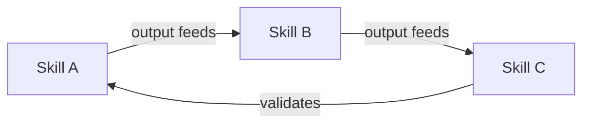
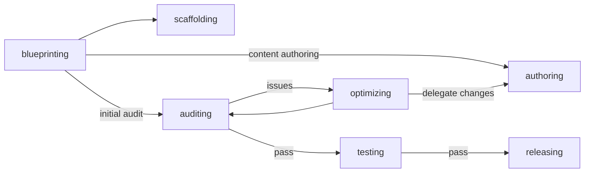
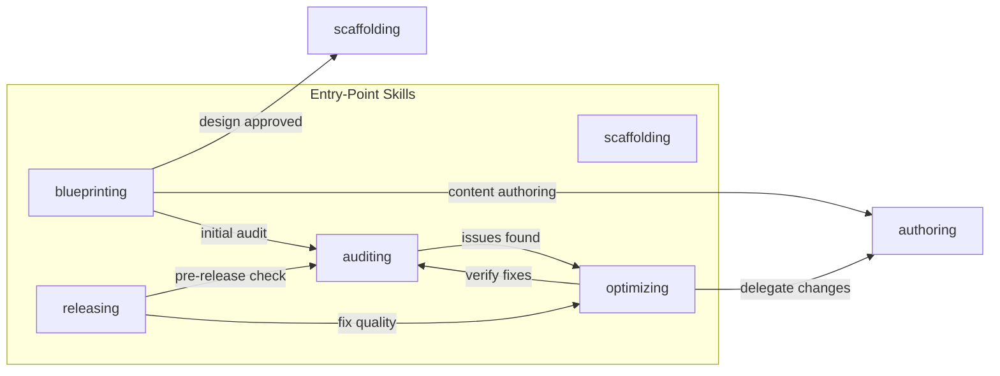

# Bundles Forge

[中文](README.zh.md)

A toolkit for building **bundle-plugins** — AI coding plugins organized around collaborative skill workflows — across Claude Code, Cursor, Codex, OpenCode, Gemini CLI, and OpenClaw.

## What is a Bundle-Plugin?

A single skill (`SKILL.md`) does one thing — an AI agent discovers it by its `description` field and loads it on demand. A **bundle-plugin** takes this further: multiple skills reference each other and form a workflow, where one skill's output feeds the next.



bundles-forge itself is a bundle-plugin — `blueprinting` produces a design, `scaffolding` generates a project from it, `auditing` validates the result, and `optimizing` iterates on issues found.

**If your plugin has 3+ skills that form a workflow, you're building a bundle-plugin.** This toolkit gives you scaffolding, quality gates, and multi-platform publishing for that pattern.

## Quick Start

### Install (Claude Code)

1. **Add the marketplace**:
   ```bash
   /plugin marketplace add OdradekAI/bundles-forge
   ```

2. **Install the plugin**:
   ```bash
   /plugin install bundles-forge@bundles-forge-dev
   ```

Or clone locally for development:

```bash
git clone https://github.com/OdradekAI/bundles-forge.git
cd bundles-forge

# Add your local marketplace
/plugin marketplace add ./

# Install the plugin
/plugin install bundles-forge@bundles-forge-dev
```

> Other platforms: see [Platform Support](#platform-support) below.

### Path A: Build a New Bundle-Plugin

```
bundles-forge:blueprinting
```

This starts a structured interview to design your project — scope, platform targets, skill decomposition. When the design is ready, the agent automatically chains into `scaffolding` (project generation) and then `authoring` (SKILL.md writing).

### Path B: Audit an Existing Project

```
cd your-bundle-plugin-project
bundles-forge:auditing
```

Runs a 10-category quality assessment with pattern-based security checks across 7 file categories.

## Concepts

| Concept | What it is |
|---------|------------|
| **Skill** | Atomic capability unit (`SKILL.md`) — discovered by description, loaded on demand |
| **Plugin** | Packaging/distribution unit — bundles skills, agents, hooks, and more |
| **Subagent** | Isolated AI assistant for delegated tasks with its own context window |
| **Hook** | Shell/HTTP/LLM/Agent action that fires automatically on lifecycle events |
| **MCP** | Open standard connecting Claude to external tools and data sources |

> Full explanations, design decisions, and architecture diagrams → [Concepts Guide](docs/concepts-guide.md)

## Skills

The 8 skills cover the full lifecycle of a bundle-plugin project, organized into two layers:

- **Orchestrators** (`blueprinting`, `optimizing`, `releasing`) — diagnose, decide, and delegate. They chain multiple skills together to accomplish multi-step goals.
- **Executors** (`scaffolding`, `authoring`, `auditing`, `testing`) — single-responsibility workers. They can be invoked directly by users or dispatched by orchestrators.



| Phase | Skill | What It Does |
|-------|-------|-------------|
| Design | `blueprinting` | Three-phase interview (needs exploration → architecture design → design review) → design document → orchestrates the creation pipeline: scaffolding, authoring, workflow design, and initial audit. |
| Scaffold | `scaffolding` | Generates project structure from design, adds or removes platform support — manifests, hooks, scripts, bootstrap skill, and per-platform files. |
| Write | `authoring` | Guides SKILL.md and agents/*.md authoring — frontmatter, descriptions, instructions, content integration, and progressive disclosure via `references/`. |
| Audit | `auditing` | 10-category quality assessment including pattern-based security checks across 7 file categories. |
| Test | `testing` | Dynamic verification — local dev-marketplace install, hook smoke tests, component discovery, and cross-platform readiness checks. |
| Optimize | `optimizing` | Engineering improvements — description triggering, token efficiency, workflow restructuring, adding skills to fill gaps, and feedback iteration. |
| Release | `releasing` | Orchestrates the pre-release pipeline: version drift check, audit, testing, documentation consistency, change coherence review, version bump, CHANGELOG update, and publish guidance. |

The bootstrap meta-skill `using-bundles-forge` provides a lightweight session prompt via hooks and full routing context on demand via the Skill tool.

**Standalone use:** `authoring`, `auditing`, and `optimizing` can be invoked independently on any existing project without going through the full lifecycle.

### Guides

Each skill has a companion guide in [`docs/`](docs/) with detailed usage, examples, and design rationale:

| Guide | Covers |
|-------|--------|
| [Concepts Guide](docs/concepts-guide.md) | Core terminology, architecture diagrams, and design decisions |
| [Blueprinting Guide](docs/blueprinting-guide.md) | Three-phase interview, dialogue strategy, design document format, decomposition patterns |
| [Scaffolding Guide](docs/scaffolding-guide.md) | Project anatomy, platform adapters, template system |
| [Authoring Guide](docs/authoring-guide.md) | SKILL.md writing patterns, progressive disclosure, agent authoring |
| [Auditing Guide](docs/auditing-guide.md) | Checklists, report templates, CI integration |
| [Optimizing Guide](docs/optimizing-guide.md) | Description tuning, token reduction, workflow restructuring |
| [Releasing Guide](docs/releasing-guide.md) | Version management, CHANGELOG format, publishing workflow |

### Agents

| Agent | Role |
|-------|------|
| `inspector` | Validates scaffolded project structure and platform adaptation |
| `auditor` | Executes systematic quality audit with security scanning |
| `evaluator` | Runs A/B skill evaluation for optimization and workflow chain verification for auditing (W10-W11) |

### Invoking Skills

Skills are invoked **automatically** (the agent matches user intent to the skill's `description` field) or **explicitly** via `bundles-forge:<skill-name>` references — for example, `bundles-forge:auditing` or `bundles-forge:blueprinting`.

## Auditing

Both `auditing` and `optimizing` accept local paths, GitHub URLs, and zip/tar.gz archives as input — the agent normalizes the target automatically.

Four audit scopes for different levels of granularity — the agent auto-detects scope from the target path:

| Scope | Invocation / Script | What It Checks |
|-------|---------------------|----------------|
| Full Project | `bundles-forge:auditing` or `bundles-forge audit-plugin` | 10 categories (structure, manifests, version sync, skill quality, cross-refs, workflow, hooks, testing, docs, security) |
| Single Skill | `bundles-forge:auditing` on `skills/authoring` or `bundles-forge audit-skill` | 4 categories (structure, skill quality, cross-refs, security) |
| Workflow | Explicit request or `bundles-forge audit-workflow` | 3 layers: static structure, semantic interface, behavioral verification (W1-W11) |
| Security Only | `bundles-forge:auditing` (security-only mode) or `bundles-forge audit-security` | Pattern-based detection across 7 file categories (skill content, hook scripts, HTTP hooks, OpenCode plugins, agent prompts, bundled scripts, MCP configs) |

### Quick Start (Scripts)

```bash
bundles-forge audit-plugin .                                      # full project audit
bundles-forge audit-skill skills/authoring                         # single skill audit
bundles-forge audit-workflow .                                     # workflow audit
bundles-forge audit-workflow --focus-skills new-skill .            # focused workflow audit
bundles-forge audit-security .                                      # security-only scan
```

Via the agent, you can also audit remote projects:

```
bundles-forge:auditing https://github.com/user/repo
bundles-forge:auditing https://github.com/user/repo/tree/main/skills/my-skill
```

Exit codes: `0` = pass, `1` = warnings, `2` = critical findings. All scripts accept `--json` for CI integration.

**After the audit:** The audit report is purely diagnostic — it identifies and scores issues but does not prescribe next steps. The user or an orchestrating skill (e.g., `optimizing`, `releasing`) decides what to fix and how.

> For detailed usage, checklists, report templates, and CI integration patterns, see [`docs/auditing-guide.md`](docs/auditing-guide.md).

## Architecture

<details>
<summary>Skill execution chains and internal routing</summary>

> For concept explanations see [Concepts Guide](docs/concepts-guide.md). For per-skill details see guides in [`docs/`](docs/).

### Skill Execution

Each skill is discovered by its description or invoked explicitly via `bundles-forge:<skill-name>`. The execution chains can be deep.



#### `bundles-forge:blueprinting` — Plan a new bundle-plugin

> Full guide: [`docs/blueprinting-guide.md`](docs/blueprinting-guide.md)

**When to use:** Starting a new project, splitting a monolithic skill into multiple skills, or composing third-party skills into a bundle.

```
User invokes bundles-forge:blueprinting
  → blueprinting: context exploration (scan existing files/skills)
  → blueprinting: Phase 1 — needs exploration (problem, users, capabilities, flow)
  → blueprinting: Phase 2 — architecture design (complexity, platforms, skill decomposition, workflow)
  → blueprinting: Phase 3 — generate design document + self-review
  → User approves design document (HARD-GATE)
  → Scaffold: invoke scaffolding — generate project structure, manifests, hooks, scripts
    → inspector agent validates scaffold (if subagents available)
  → Author Content: invoke authoring — guide SKILL.md and agents/*.md content (with design context)
  → Wire Workflow: blueprinting wires cross-references, integration sections
  → Run Audit: invoke auditing — initial quality check
```

#### `bundles-forge:scaffolding` — Generate or adapt project structure

> Full guide: [`docs/scaffolding-guide.md`](docs/scaffolding-guide.md)

**When to use:** Adding platform support to an existing project, removing a platform, or generating a new project directly (without going through blueprinting first).

```
User invokes bundles-forge:scaffolding
  → scaffolding: detect context (new project vs existing project)
  → New project: ask mode preference (intelligent/custom), generate structure
  → Existing project:
    → Add/remove platform: generate adapter files, update .version-bump.json, hooks, README
    → Add/remove optional components (MCP servers, CLI executables, LSP, userConfig, output-styles)
    → inspector agent validates changes (if subagents available)
```

#### `bundles-forge:auditing` — Quality assessment

> Full guide: [`docs/auditing-guide.md`](docs/auditing-guide.md)

**When to use:** Reviewing a project before release, after significant changes, or when scanning a third-party skill for security risks.

```
User invokes bundles-forge:auditing
  → auditing: detect scope (full project vs single skill vs workflow)
  → Full project: 10 categories (structure, manifests, version sync,
    quality, cross-refs, workflow, hooks, testing, docs, security)
    → auditor agent runs checklist (if subagents available)
    → Scripts: bundles-forge audit-plugin, audit-workflow, audit-security, audit-skill
  → Single skill: 4 categories (structure, quality, cross-refs, security)
  → Workflow: 3 layers (static structure, semantic interface, behavioral)
  → Score + report with Critical / Warning / Info findings
  → Report delivered to calling context (user or orchestrating skill) for action
```

#### `bundles-forge:auditing` (security-only mode) — Security-focused audit

**When to use:** Quick security-only check. Maps to the `auditing` skill in security-only mode — runs only Category 10 (the 7-surface security scan: skill content, hook scripts, HTTP hooks, OpenCode plugins, agent prompts, bundled scripts, MCP configs), skipping Categories 1-8.

#### `bundles-forge:optimizing` — Engineering improvements

> Full guide: [`docs/optimizing-guide.md`](docs/optimizing-guide.md)

**When to use:** Improving description triggering accuracy, reducing token usage, fixing workflow chain gaps, adding skills to fill gaps, restructuring workflows, or iterating on user feedback about a specific skill.

```
User invokes bundles-forge:optimizing
  → optimizing: detect scope (project vs single skill)
  → Project scope: 6 optimization targets
    (descriptions, tokens, workflow chains,
     security, restructuring, optional components)
  → Skill scope: targeted optimization + feedback iteration
  → Description A/B test:
    → 2x evaluator agents in parallel (if subagents available)
    → Compare reports → pick winner
  → Verify fixes via auditing
```

#### `bundles-forge:releasing` — Version bump and publish

> Full guide: [`docs/releasing-guide.md`](docs/releasing-guide.md)

**When to use:** Preparing a release — version drift check, quality gate, documentation consistency, version bump, CHANGELOG update, and publishing guidance.

```
User invokes bundles-forge:releasing
  → releasing: verify prerequisites (clean working tree, branch check)
  → Pre-flight checks
    → bundles-forge bump-version --check (version drift)
    → auditing (full quality + security)
    → bundles-forge audit-docs (documentation consistency)
  → Address critical findings (block release until resolved)
  → Documentation sync (change coherence review + doc updates)
  → bundles-forge bump-version <new-version> (update all manifests)
  → Update CHANGELOG.md and README.md
  → Final verification (--check + --audit + bundles-forge audit-docs)
  → Commit, tag, push, gh release create
```

</details>

## Platform Support

### Cursor

Search for `bundles-forge` in the Cursor plugin marketplace, or use `/add-plugin bundles-forge`.

### Codex

See [`.codex/INSTALL.md`](.codex/INSTALL.md)

### OpenCode

See [`.opencode/INSTALL.md`](.opencode/INSTALL.md)

### Gemini CLI

```bash
gemini extensions install https://github.com/OdradekAI/bundles-forge.git
```

### OpenClaw

From ClawHub:

```bash
openclaw bundles install clawhub:bundles-forge
```

From a local clone:

```bash
openclaw plugins install ./bundles-forge
```

Verify with `openclaw plugins inspect bundles-forge` — should show `Format: bundle`.

## Tips for Long Sessions

Skills, audit reports, and script output accumulate in the conversation context over a long session. If you notice the agent slowing down or losing track of earlier context:

- **Start a fresh session** for each major lifecycle phase (blueprinting, authoring, auditing)
- **Invoke skills explicitly** (`bundles-forge:auditing`, `bundles-forge:optimizing`) to re-anchor the agent on the current task
- **Prefer script output over inline checks** — `bundles-forge audit-plugin .` produces a compact summary instead of the agent reasoning through each check

## Prerequisites

- **Python 3.9+** — required for auditing scripts and version management tools
- **`python` or `python3` in PATH** — the `bundles-forge` CLI dispatcher probes both via `find_python()`. On systems where only `python3` is available, create an alias or symlink:
  - **macOS/Linux:** `sudo ln -s $(which python3) /usr/local/bin/python`
  - **Windows:** Python installer includes `python` by default; verify with `python --version`

## Contributing

Contributions welcome. Please follow the existing code style and ensure all platform manifests stay in sync using `bundles-forge bump-version --check` and `bundles-forge checklists --check`.

## License

Apache-2.0
