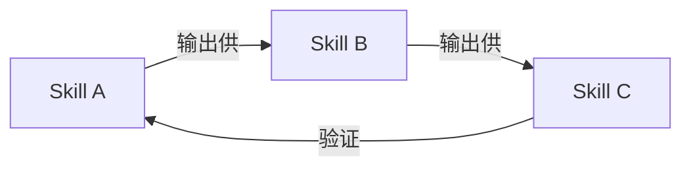
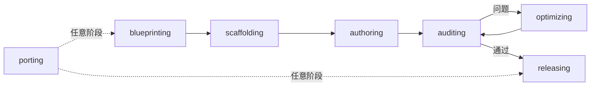
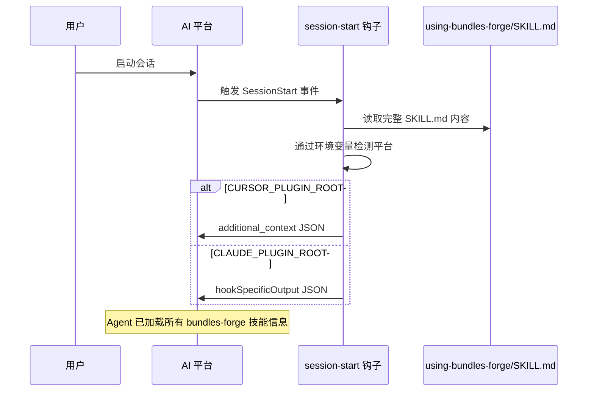
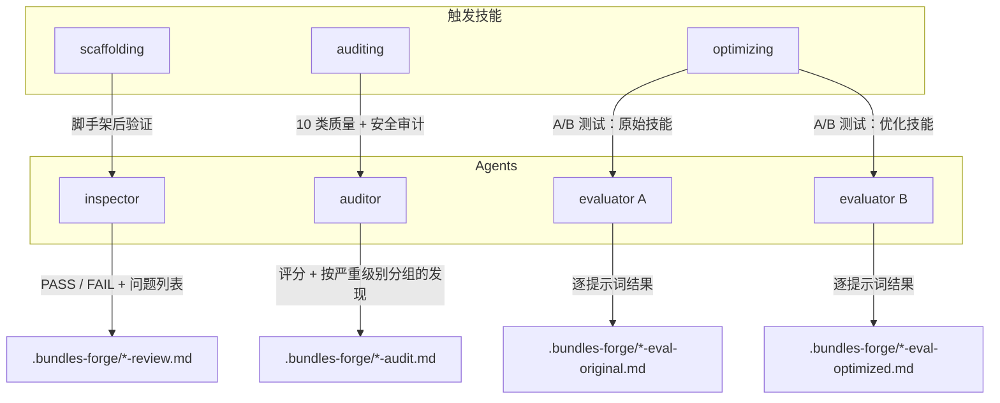
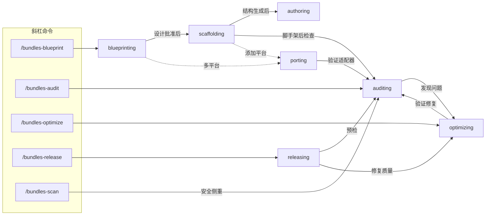

# Bundles Forge

[English](README.md)

构建 **bundle-plugin** 的工程化工具包 — 以协作式技能工作流为核心的 AI 编程插件 — 覆盖 Claude Code、Cursor、Codex、OpenCode 和 Gemini CLI 五大平台。

## 什么是 Bundle-Plugin？

单个 skill（`SKILL.md`）做一件事 — AI Agent 通过其 `description` 字段发现并按需加载。**Bundle-plugin** 更进一步：多个 skill 相互引用、形成工作流，上一个 skill 的输出直接供下一个消费。



bundles-forge 本身就是一个 bundle-plugin — `blueprinting` 产出设计方案，`scaffolding` 据此生成项目，`auditing` 验证产物，`optimizing` 迭代改进。

**如果你的插件有 3 个以上相互协作形成工作流的 skill，你就是在构建 bundle-plugin。** 本工具包为这种模式提供脚手架、质量关卡和多平台发布能力。

## 快速开始

### 安装（Claude Code）

```bash
claude plugin install bundles-forge
```

开发模式（任意平台）：

```bash
git clone https://github.com/odradekai/bundles-forge.git
cd bundles-forge
claude plugin link .
```

> 其他平台安装方式请参见底部[平台支持](#平台支持)。

### 路径 A：从零构建新 Bundle-Plugin

```
/bundles-blueprint
```

启动结构化访谈来设计你的项目 — 范围、目标平台、skill 拆分方案。设计完成后，Agent 自动链式进入 `scaffolding`（项目生成）和 `authoring`（SKILL.md 编写）。

### 路径 B：审计现有项目

```
cd your-bundle-plugin-project
/bundles-audit
```

执行 10 大类质量评估，含 5 大攻击面安全扫描。

## 技能

8 个技能覆盖 bundle-plugin 项目的完整生命周期：



| 阶段 | 技能 | 作用 |
|------|------|------|
| 设计 | `blueprinting` | 通过结构化访谈确定项目范围、目标平台和 skill 拆分方案，产出设计文档。 |
| 搭建 | `scaffolding` | 根据设计方案生成完整的项目结构 — 清单、钩子、脚本、引导 skill 和各平台文件。 |
| 编写 | `authoring` | 指导 SKILL.md 编写 — frontmatter、"Use when..." 描述、指令和通过 `references/` 实现的渐进式加载。 |
| 审计 | `auditing` | 10 大类质量评估，含 5 大攻击面安全扫描。 |
| 优化 | `optimizing` | 工程改进 — 描述触发准确性、token 效率、工作流链路、反馈迭代。 |
| 适配 | `porting` | 添加或修复平台支持，从模板生成清单。 |
| 发布 | `releasing` | 编排发布前流水线：版本漂移检查、审计、版本升级、CHANGELOG 更新和发布指引。 |

引导元技能 `using-bundles-forge` 在会话启动时通过钩子自动注入 — 它让 Agent 感知所有可用技能并自动路由任务。

**独立调用：** `authoring`、`auditing` 和 `optimizing` 可脱离完整生命周期，在任意现有项目上独立使用。

### Agents

| Agent | 职责 |
|-------|------|
| `inspector` | 验证脚手架生成的项目结构 |
| `auditor` | 执行系统化质量审计与安全扫描 |
| `evaluator` | 运行 A/B skill 评估的单侧测试，用于优化对比 |

### 命令

| 命令 | 技能 |
|------|------|
| `/bundles-forge` | `using-bundles-forge` |
| `/bundles-blueprint` | `blueprinting` |
| `/bundles-audit` | `auditing` |
| `/bundles-optimize` | `optimizing` |
| `/bundles-release` | `releasing` |
| `/bundles-scan` | `auditing` |

没有斜杠命令的技能通过两种方式调用：**自动匹配**（Agent 将用户意图与技能的 `description` 字段匹配）或**显式引用**（其他技能在指令中通过 `bundles-forge:<skill-name>` 链式调用）。

## 审计

四种审计范围，覆盖不同粒度 — Agent 根据目标路径自动检测范围：

| 范围 | 命令 / 脚本 | 检查内容 |
|------|------------|---------|
| 完整项目 | `/bundles-audit` 或 `audit_project.py` | 10 大类（结构、清单、版本同步、技能质量、交叉引用、工作流、钩子、测试、文档、安全） |
| 单个技能 | `/bundles-audit skills/authoring` 或 `audit_skill.py` | 4 类（结构、技能质量、交叉引用、安全） |
| 工作流 | 显式请求 或 `audit_workflow.py` | 3 层：静态结构、语义接口、行为验证（W1-W12） |
| 仅安全扫描 | `/bundles-scan` 或 `scan_security.py` | 5 大攻击面（技能内容、钩子、插件、Agent 提示词、脚本） |

### 快速开始（脚本）

```bash
python scripts/audit_project.py .                                      # 完整项目审计
python scripts/audit_skill.py skills/authoring                         # 单技能审计
python scripts/audit_workflow.py .                                     # 工作流审计
python scripts/audit_workflow.py --focus-skills new-skill .            # 聚焦式工作流审计
python scripts/scan_security.py .                                      # 仅安全扫描
```

退出码：`0` = 通过，`1` = 有警告，`2` = 有严重问题。所有脚本支持 `--json` 用于 CI 集成。

**审计之后：** 严重问题 → 修复或调用 `bundles-forge:optimizing`。准备发布 → 调用 `bundles-forge:releasing`。

> 详细用法、检查清单、报告模板和 CI 集成模式请参见 [`docs/auditing-guide.md`](docs/auditing-guide.md)。

## 架构

<details>
<summary>会话引导与技能路由的内部机制</summary>

### 会话引导

会话启动时，`session-start` 钩子读取 `using-bundles-forge/SKILL.md` 并注入 Agent 上下文，使其获得完整的技能清单和路由逻辑。



### 技能路由

引导上下文加载完成后，Agent 通过三条路径路由请求：

1. **斜杠命令** — `/bundles-blueprint`、`/bundles-audit` 等。每个命令文件通过 `bundles-forge:<skill-name>` 重定向到对应技能。
2. **显式引用** — 其他技能或用户直接引用 `bundles-forge:<skill-name>`，Agent 使用平台的技能加载工具。
3. **描述匹配** — Agent 将用户意图与各技能的 `description` 字段（以 "Use when..." 开头）匹配，调用最佳匹配。

### 技能链式调用

技能之间通过**文字指令**而非代码 API 进行链式调用。当一个技能完成后，它在指令中告诉 Agent 接下来应调用哪个技能（使用 `project:skill-name` 约定）。宿主平台负责实际加载：

| 平台 | 技能加载工具 |
|------|------------|
| Claude Code | `Skill` tool |
| Cursor | `Skill` tool |
| Gemini CLI | `activate_skill` tool |
| Codex | 从 `~/.agents/skills/` 文件系统发现 |
| OpenCode | 通过插件 transform 调用 `use_skill` |

### Agent 调度

三个专用 Agent 负责需要隔离、只读执行的任务。它们以**子代理**形式派遣 — 仅在宿主平台支持子代理时触发。若子代理不可用，主 Agent 会内联执行相同工作。

所有 Agent 共享两项约束：`disallowedTools: Edit`（不能修改项目文件），报告保存至 `.bundles-forge/`。



| Agent | 触发者 | 触发时机 | 作用 | 输出 |
|-------|--------|---------|------|------|
| `inspector` | `scaffolding` | 项目结构生成后 | 验证目录、清单、版本同步、钩子和技能 frontmatter 规范 | PASS/FAIL + 按严重级别分类的问题 |
| `auditor` | `auditing` | 执行完整或技能级审计时 | 运行 10 大类检查清单（结构、清单、版本同步、质量、交叉引用、工作流、钩子、测试、文档、安全） | 加权评分 + 严重/警告/信息级发现 |
| `evaluator` | `optimizing` | 描述 A/B 测试或反馈 A/B 测试时 | 针对单个 SKILL.md 变体（标记为 `original` 或 `optimized`）运行测试提示词，记录每个提示词是否正确触发该技能 | 逐提示词触发/响应报告 |

**关键细节：** `optimizing` 会**并行派遣两个 evaluator** — 一个测试原始技能，一个测试优化变体。父技能对比两份报告以决定哪个版本胜出。

### 命令执行

每个斜杠命令是指向技能的轻量指针，真正的逻辑在技能内部 — 但执行链路可以很深。



#### `/bundles-blueprint` — 规划新 bundle-plugin

**适用场景：** 从零开始新项目、将单体技能拆分为多个技能、或将第三方技能组合成 bundle。

```
用户执行 /bundles-blueprint
  → blueprinting：结构化访谈（范围、平台、skill 拆分方案）
  → 用户批准设计文档
  → scaffolding：生成项目结构、清单、钩子、脚本
    → inspector agent 验证脚手架（如子代理可用）
  → authoring：指导每个 skill 的 SKILL.md 编写
  → porting：添加平台适配器（如果是多平台项目）
```

#### `/bundles-audit` — 质量评估

**适用场景：** 发布前审查项目、重大变更后复查、或扫描第三方技能的安全风险。

```
用户执行 /bundles-audit
  → auditing：检测范围（完整项目 vs 单个技能 vs 工作流）
  → 完整项目：10 大类检查（结构、清单、版本同步、
    质量、交叉引用、工作流、钩子、测试、文档、安全）
    → auditor agent 运行检查清单（如子代理可用）
    → 脚本：audit_project.py, audit_workflow.py, scan_security.py, lint_skills.py
  → 单个技能：4 类检查（结构、质量、交叉引用、安全）
  → 工作流：3 层检查（静态结构、语义接口、行为验证）
  → 评分 + 报告（严重 / 警告 / 信息）
  → 发现严重问题？ → 提供修复 → 重审一次
  → 发现警告？ → 建议使用 optimizing 技能
```

#### `/bundles-scan` — 安全侧重审计

**适用场景：** 与 `/bundles-audit` 相同但强调安全扫描。映射到同一个 `auditing` 技能 — 5 大攻击面安全扫描（SKILL.md 内容、钩子脚本、插件代码、Agent 提示词、打包脚本）作为第 9 类检查执行。

#### `/bundles-optimize` — 工程改进

**适用场景：** 提升描述触发准确性、减少 token 用量、修补工作流链路缺口、或迭代处理用户对特定技能的反馈。

```
用户执行 /bundles-optimize
  → optimizing：检测范围（项目 vs 单个技能）
  → 项目范围：6 项优化目标
    （描述、token、渐进式加载、工作流链路、
     平台覆盖、安全修复）
  → 技能范围：定向优化 + 反馈迭代
  → 描述 A/B 测试：
    → 2 个 evaluator agent 并行（如子代理可用）
    → 对比报告 → 选出胜者
  → 通过 auditing 验证修复
```

#### `/bundles-release` — 版本升级与发布

**适用场景：** 准备发布 — 版本漂移检查、质量关卡、版本升级、CHANGELOG 更新和发布指引。

```
用户执行 /bundles-release
  → releasing：预检
    → bump_version.py --check（版本漂移检查）
    → auditing（完整质量 + 安全审计）
  → 处理严重发现（解决前阻止发布）
  → bump_version.py <new-version>（更新所有清单）
  → 更新 CHANGELOG.md 和 README.md
  → 最终验证（--check + --audit）
  → 提交、打标签、推送、gh release create
```

</details>

## 平台支持

### Cursor

在 Cursor 插件市场搜索 `bundles-forge`，或使用 `/add-plugin bundles-forge`。

### Codex

参见 [`.codex/INSTALL.md`](.codex/INSTALL.md)

### OpenCode

参见 [`.opencode/INSTALL.md`](.opencode/INSTALL.md)

### Gemini CLI

```bash
gemini extensions install https://github.com/odradekai/bundles-forge.git
```

## 长会话使用建议

技能内容、审计报告和脚本输出会随对话持续累积在上下文中。如果 Agent 变慢或丢失早期上下文：

- **为每个主要生命周期阶段开启新会话**（blueprinting、authoring、auditing）
- **使用斜杠命令**（`/bundles-audit`、`/bundles-optimize`）将 Agent 重新锚定到当前任务
- **优先使用脚本输出而非内联检查** — `python scripts/audit_project.py .` 产出紧凑摘要，避免 Agent 逐项推理占用上下文

## 贡献

欢迎贡献。请遵循现有代码风格，并通过 `python scripts/bump_version.py --check` 确保所有平台清单版本同步。

## 许可证

Apache-2.0
