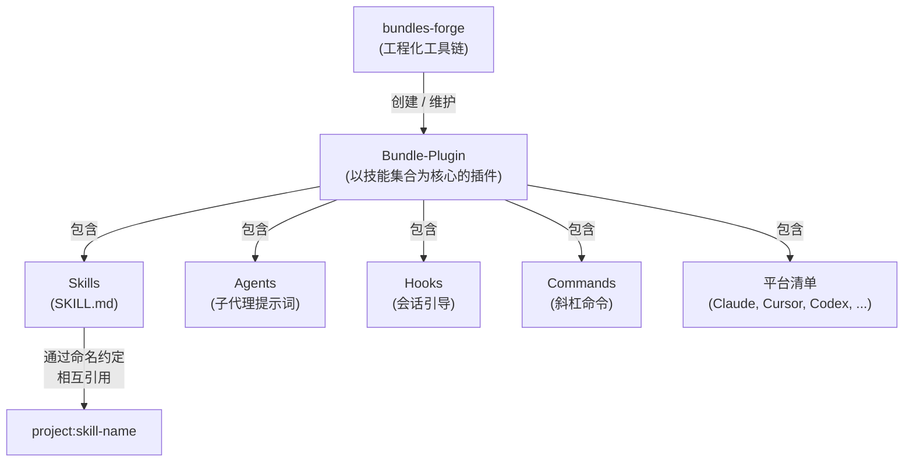
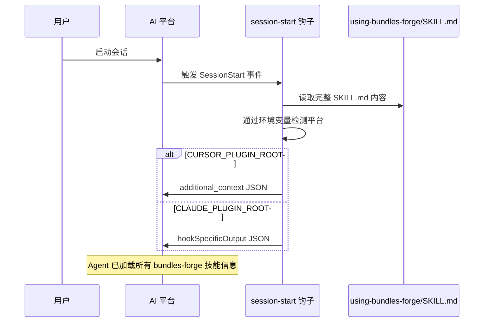
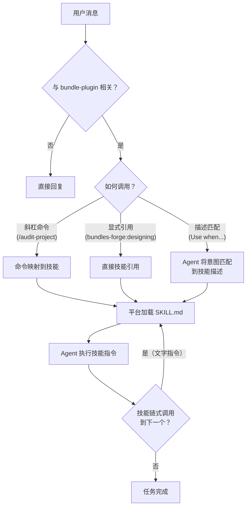
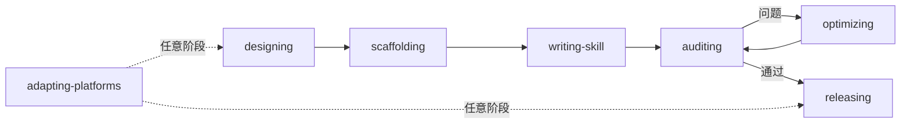

# Bundles Forge

[English](README.md)

技能项目工程化工具包：脚手架搭建、多平台适配、版本管理、质量审计，以及技能全生命周期管理，覆盖 5 大 AI 编程平台。

## 安装

### Claude Code

```bash
claude plugin install bundles-forge
```

开发模式：

```bash
git clone https://github.com/odradekai/bundles-forge.git
cd bundles-forge
claude plugin link .
```

### Cursor

在 Cursor 插件市场搜索 `bundles-forge`，或使用 `/add-plugin bundles-forge`。

### Codex

参见 [`.codex/INSTALL.md`](.codex/INSTALL.md)

### OpenCode

参见 [`.opencode/INSTALL.md`](.opencode/INSTALL.md)

### Gemini CLI

```bash
gemini extensions install https://github.com/odradekai/bundles-forge.git
```

## 核心概念



| 术语 | 定义 |
|------|------|
| **Skill** | 能力的原子单元 — 一个 `SKILL.md` 文件（可附带 `references/`），AI Agent 通过其 `description` 字段发现并按需加载。 |
| **Plugin** | AI 编程平台的分发格式。一个 Plugin 可包含 skills、agents、commands、hooks、MCP servers 等组件。 |
| **Bundle-plugin** | 以**协作式技能集合**为核心的 Plugin 组织形态 — 技能之间相互引用、形成工作流。"Bundles" 是本项目对此模式的简称。 |
| **bundles-forge** | 一个工程化工具链（本身也是一个 bundle-plugin），用于跨 5 个平台创建、审计、优化和发布 bundle-plugin 项目。 |

### 为什么需要 Bundles？

普通插件可能只有一个技能做一件事。而 **bundle-plugin** 项目中的技能会 _协作_：技能 A 的输出供技能 B 消费，技能 C 验证 A 和 B 的产物。bundles-forge 本身就是一个 bundle-plugin — `designing` 输出设计方案给 `scaffolding`，后者触发 `auditing`，审计可能调用 `optimizing`。

如果你的插件有 3 个以上相互协作形成工作流的技能，你就是在构建 bundle-plugin。本工具链为这种模式提供脚手架、质量关卡和多平台发布能力。

### 技能间的调用机制

技能之间通过**文字指令**而非代码 API 进行链式调用。当一个技能完成后，它在指令中告诉 Agent 接下来应调用哪个技能（使用 `project:skill-name` 约定）。宿主平台的技能加载工具负责实际加载：

| 平台 | 工具 |
|------|------|
| Claude Code | `Skill` tool |
| Cursor | `Skill` tool |
| Gemini CLI | `activate_skill` tool |
| Codex | 从 `~/.agents/skills/` 文件系统发现 |
| OpenCode | 通过插件 transform 调用 `use_skill` |

## 运行机制

### 会话引导

会话启动时，`session-start` 钩子读取 `using-bundles-forge/SKILL.md`（引导元技能）的完整内容，注入到 Agent 的上下文中。这使 Agent 获得所有可用技能的感知和任务路由能力。



### 技能路由

引导上下文加载完成后，Agent 通过三种机制将用户请求路由到正确的技能：



**三种调用路径：**

1. **斜杠命令** — `/design-project`、`/audit-project` 等。每个命令文件通过 `bundles-forge:skill-name` 重定向到对应技能。
2. **显式引用** — 其他技能或用户直接引用 `bundles-forge:skill-name`，Agent 使用平台的技能加载工具。
3. **描述匹配** — Agent 将用户意图与各技能的 `description` 字段（以 "Use when..." 开头）进行匹配，调用最佳匹配。

## 技能一览

| 技能 | 说明 |
|------|------|
| `using-bundles-forge` | 引导元技能 — 会话启动时通过钩子注入；建立技能路由、命名约定和完整的技能清单 |
| `designing` | 通过结构化访谈规划新 bundle-plugin，或将复杂技能拆分为 bundle-plugin 项目 |
| `scaffolding` | 生成项目结构、平台清单、钩子脚本和引导技能 |
| `writing-skill` | 指导 SKILL.md 文件编写 — 结构、描述、渐进式加载 |
| `auditing` | 质量评估（9 大类）和安全扫描（5 大攻击面） |
| `optimizing` | 工程化优化与反馈迭代 — 描述、token 效率、工作流链路 |
| `adapting-platforms` | 添加平台支持（Claude Code、Cursor、Codex、OpenCode、Gemini CLI） |
| `releasing` | 版本管理与发布流水线 — 审计、版本升级、CHANGELOG、发布 |

## 使用指南

### 完整生命周期

8 个技能覆盖 bundle-plugin 项目的完整生命周期 — 从初始设计到发布：



| 阶段 | 技能 | 作用 |
|------|------|------|
| 1. 设计 | `bundles-forge:designing` | 通过结构化访谈确定项目范围、目标平台和技能拆分方案，产出设计文档。 |
| 2. 搭建 | `bundles-forge:scaffolding` | 根据设计方案生成完整的项目结构 — 清单、钩子、脚本、引导技能和各平台文件。 |
| 3. 编写 | `bundles-forge:writing-skill` | 指导每个 SKILL.md 的编写 — frontmatter、"Use when..." 描述、指令和通过 `references/` 实现的渐进式加载。 |
| 4. 审计 | `bundles-forge:auditing` | 9 大类质量评估，含 5 大攻击面安全扫描。运行 `scripts/audit-project.py`，编排 `lint-skills.py` + `scan-security.py` + 结构/清单/版本检查。 |
| 5. 优化 | `bundles-forge:optimizing` | 工程改进与反馈迭代 — 描述触发准确性、token 效率、工作流链路、用户反馈的技能问题。 |
| 6. 适配 | `bundles-forge:adapting-platforms` | 添加或修复平台支持，从 `skills/adapting-platforms/assets/` 中的模板生成清单。 |
| 7. 发布 | `bundles-forge:releasing` | 编排完整的发布前流水线：版本漂移检查、审计、版本升级、CHANGELOG 更新和发布指引。 |

### 独立可调用的技能

以下技能可脱离完整生命周期独立调用：

| 技能 | 独立使用场景 |
|------|------------|
| `writing-skill` | 为任意项目指导编写单个 SKILL.md |
| `auditing` | 对任意现有 bundle-plugin 项目执行质量审计或安全扫描 |
| `optimizing` | 优化现有项目或基于用户反馈改进技能 |

## Agents

| Agent | 职责 |
|-------|------|
| `reviewer` | 验证脚手架生成的项目结构 |
| `auditor` | 执行系统化质量审计与安全扫描 |
| `evaluator` | 运行 A/B 技能评估的单侧测试，用于优化对比 |

## 命令

| 命令 | 指向 |
|------|------|
| `/use-bundles-forge` | `bundles-forge:using-bundles-forge` |
| `/design-project` | `bundles-forge:designing` |
| `/scaffold-project` | `bundles-forge:scaffolding` |
| `/audit-project` | `bundles-forge:auditing` |
| `/scan-security` | `bundles-forge:auditing` |

没有斜杠命令的技能通过两种方式调用：**自动匹配** — Agent 将用户意图与技能的 `description` 字段匹配；**显式引用** — 其他技能在指令中通过 `bundles-forge:skill-name` 链式调用。

## 贡献

欢迎贡献。请遵循现有代码风格，并通过 `scripts/bump-version.sh --check` 确保所有平台清单版本同步。

## 许可证

MIT
