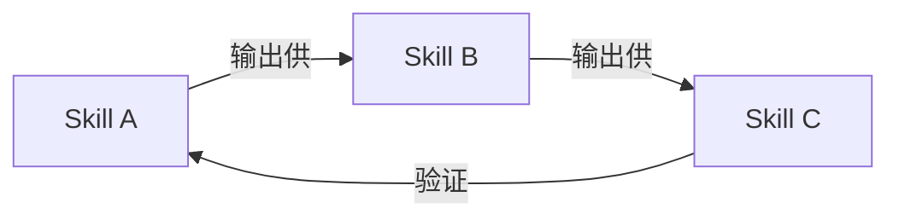
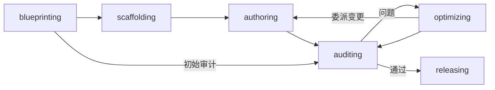
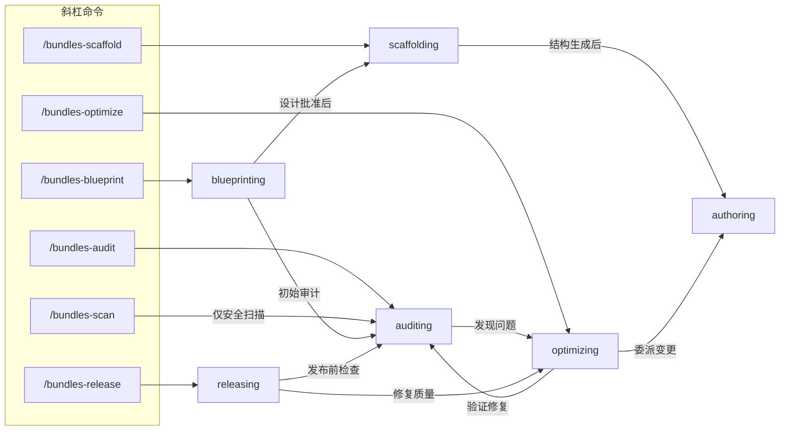

# Bundles Forge

[English](README.md)

构建 **bundle-plugin** 的工程化工具包 — 以协作式技能工作流为核心的 AI 编程插件 — 覆盖 Claude Code、Cursor、Codex、OpenCode 和 Gemini CLI 五大平台。

## 什么是 Bundle-Plugin？

单个 skill（`SKILL.md`）做一件事 — AI Agent 通过其 `description` 字段发现并按需加载。**Bundle-plugin** 更进一步：多个 skill 相互引用、形成工作流，上一个 skill 的输出直接供下一个消费。



bundles-forge 本身就是一个 bundle-plugin — `blueprinting` 产出设计方案，`scaffolding` 据此生成项目，`auditing` 验证产物，`optimizing` 迭代改进。

**如果你的插件有 3 个以上相互协作形成工作流的 skill，你就是在构建 bundle-plugin。** 本工具包为这种模式提供脚手架、质量关卡和多平台发布能力。

## 快速开始

### 安装（Claude Code）

```bash
claude plugin install bundles-forge
```

开发模式（任意平台）：

```bash
git clone https://github.com/odradekai/bundles-forge.git
cd bundles-forge
claude plugin link .
```

> 其他平台安装方式请参见底部[平台支持](#平台支持)。

### 路径 A：从零构建新 Bundle-Plugin

```
/bundles-blueprint
```

启动结构化访谈来设计你的项目 — 范围、目标平台、skill 拆分方案。设计完成后，Agent 自动链式进入 `scaffolding`（项目生成）和 `authoring`（SKILL.md 编写）。

### 路径 B：审计现有项目

```
cd your-bundle-plugin-project
/bundles-audit
```

执行 10 大类质量评估，含 7 大攻击面安全扫描。

## 概念

| 概念 | 简介 |
|------|------|
| **Skill** | 原子能力单元（`SKILL.md`）— 通过 description 发现，按需加载 |
| **Plugin** | 打包分发单元 — 捆绑技能、Agent、钩子等组件 |
| **Subagent** | 拥有独立上下文窗口的隔离 AI 助手，用于委托任务 |
| **Hook** | 在生命周期事件上自动触发的 Shell/HTTP/LLM/Agent 动作 |
| **Command** | 斜杠命令入口（`/audit`），调用对应的技能 |
| **MCP** | 连接 Claude 与外部工具和数据源的开放标准 |

> 完整解释、设计决策和架构图 → [概念指南](docs/concepts-guide.zh.md)

## 技能

7 个技能覆盖 bundle-plugin 项目的完整生命周期，分为两层：

- **编排器**（`blueprinting`、`optimizing`、`releasing`）— 诊断、决策、委派。它们将多个技能串联起来完成多步目标。
- **执行器**（`scaffolding`、`authoring`、`auditing`）— 单一职责工作者。可由用户直接调用，也可由编排器派遣。



| 阶段 | 技能 | 作用 |
|------|------|------|
| 设计 | `blueprinting` | 结构化访谈 → 设计文档 → 编排创建流水线：脚手架生成、内容编写、工作流设计和初始审计。 |
| 搭建 | `scaffolding` | 根据设计方案生成项目结构，添加或移除平台支持 — 清单、钩子、脚本、引导 skill 和各平台文件。 |
| 编写 | `authoring` | 指导 SKILL.md 和 agents/*.md 编写 — frontmatter、描述、指令、内容集成和通过 `references/` 实现的渐进式加载。 |
| 审计 | `auditing` | 10 大类质量评估，含 7 大攻击面安全扫描。 |
| 优化 | `optimizing` | 工程改进 — 描述触发准确性、token 效率、工作流重构、添加技能填补缺口、反馈迭代。 |
| 发布 | `releasing` | 编排发布前流水线：版本漂移检查、审计、文档一致性检查、变更一致性审查、版本升级、CHANGELOG 更新和发布指引。 |

引导元技能 `using-bundles-forge` 在会话启动时通过钩子自动注入 — 它让 Agent 感知所有可用技能并自动路由任务。

**独立调用：** `authoring`、`auditing` 和 `optimizing` 可脱离完整生命周期，在任意现有项目上独立使用。

### 指南

每个技能在 [`docs/`](docs/) 下都有配套指南，包含详细用法、示例和设计原理：

| 指南 | 涵盖内容 |
|------|---------|
| [概念指南](docs/concepts-guide.zh.md) | 核心术语、架构图和设计决策 |
| [蓝图指南](docs/blueprinting-guide.zh.md) | 访谈技巧、设计文档格式、拆分模式 |
| [脚手架指南](docs/scaffolding-guide.zh.md) | 项目结构、平台适配器、模板系统 |
| [编写指南](docs/authoring-guide.zh.md) | SKILL.md 编写模式、渐进式加载、Agent 编写 |
| [审计指南](docs/auditing-guide.zh.md) | 检查清单、报告模板、CI 集成 |
| [优化指南](docs/optimizing-guide.zh.md) | 描述调优、token 压缩、工作流重构 |
| [发布指南](docs/releasing-guide.zh.md) | 版本管理、CHANGELOG 格式、发布流程 |

### Agents

| Agent | 职责 |
|-------|------|
| `inspector` | 验证脚手架生成的项目结构和平台适配 |
| `auditor` | 执行系统化质量审计与安全扫描 |
| `evaluator` | 运行 A/B skill 评估用于优化对比，以及工作流链验证用于审计（W11-W12） |

### 命令

| 命令 | 技能 |
|------|------|
| `/bundles-forge` | `using-bundles-forge` |
| `/bundles-blueprint` | `blueprinting` |
| `/bundles-scaffold` | `scaffolding` |
| `/bundles-audit` | `auditing` |
| `/bundles-optimize` | `optimizing` |
| `/bundles-release` | `releasing` |
| `/bundles-scan` | `auditing` |

没有斜杠命令的技能通过两种方式调用：**自动匹配**（Agent 将用户意图与技能的 `description` 字段匹配）或**显式引用**（其他技能在指令中通过 `bundles-forge:<skill-name>` 链式调用）。

## 审计

`auditing` 和 `optimizing` 均支持本地路径、GitHub URL 和 zip/tar.gz 归档作为输入 — Agent 会自动归一化目标。

四种审计范围，覆盖不同粒度 — Agent 根据目标路径自动检测范围：

| 范围 | 命令 / 脚本 | 检查内容 |
|------|------------|---------|
| 完整项目 | `/bundles-audit` 或 `audit_project.py` | 10 大类（结构、清单、版本同步、技能质量、交叉引用、工作流、钩子、测试、文档、安全） |
| 单个技能 | `/bundles-audit skills/authoring` 或 `audit_skill.py` | 4 类（结构、技能质量、交叉引用、安全） |
| 工作流 | 显式请求 或 `audit_workflow.py` | 3 层：静态结构、语义接口、行为验证（W1-W12） |
| 仅安全扫描 | `/bundles-scan` 或 `scan_security.py` | 7 大攻击面（技能内容、Hook 脚本、HTTP hooks、OpenCode 插件、Agent 提示词、打包脚本、MCP 配置） |

### 快速开始（脚本）

```bash
python scripts/audit_project.py .                                      # 完整项目审计
python scripts/audit_skill.py skills/authoring                         # 单技能审计
python scripts/audit_workflow.py .                                     # 工作流审计
python scripts/audit_workflow.py --focus-skills new-skill .            # 聚焦式工作流审计
python scripts/scan_security.py .                                      # 仅安全扫描
```

通过 Agent 还可以审计远程项目：

```
/bundles-audit https://github.com/user/repo
/bundles-audit https://github.com/user/repo/tree/main/skills/my-skill
```

退出码：`0` = 通过，`1` = 有警告，`2` = 有严重问题。所有脚本支持 `--json` 用于 CI 集成。

**审计之后：** 严重问题 → 修复或调用 `bundles-forge:optimizing`。准备发布 → 调用 `bundles-forge:releasing`。

> 详细用法、检查清单、报告模板和 CI 集成模式请参见 [`docs/auditing-guide.zh.md`](docs/auditing-guide.zh.md)。

## 架构

<details>
<summary>命令执行链路与内部路由</summary>

> 概念解释见[概念指南](docs/concepts-guide.zh.md)。各技能详情见 [`docs/`](docs/) 中的指南。

### 命令执行

每个斜杠命令是指向技能的轻量指针，真正的逻辑在技能内部 — 但执行链路可以很深。



#### `/bundles-blueprint` — 规划新 bundle-plugin

> 完整指南：[`docs/blueprinting-guide.zh.md`](docs/blueprinting-guide.zh.md)

**适用场景：** 从零开始新项目、将单体技能拆分为多个技能、或将第三方技能组合成 bundle。

```
用户执行 /bundles-blueprint
  → blueprinting：结构化访谈（范围、平台、skill 拆分方案）
  → 用户批准设计文档
  → scaffolding：生成项目结构、清单、钩子、脚本
    → inspector agent 验证脚手架（如子代理可用）
  → authoring：指导 SKILL.md 和 agents/*.md 内容编写
  → blueprinting：工作流设计（交叉引用、集成章节）
  → auditing：初始质量检查
```

#### `/bundles-scaffold` — 生成或适配项目结构

> 完整指南：[`docs/scaffolding-guide.zh.md`](docs/scaffolding-guide.zh.md)

**适用场景：** 为现有项目添加平台支持、移除平台、或不经过 blueprinting 直接生成新项目。

```
用户执行 /bundles-scaffold
  → scaffolding：检测上下文（新项目 vs 现有项目）
  → 新项目：询问模式偏好（intelligent/custom），生成结构
  → 现有项目：
    → 添加/移除平台：生成适配器文件、更新 .version-bump.json、钩子、README
    → 添加/移除可选组件（MCP 服务器、CLI 可执行文件、LSP、userConfig、output-styles）
    → inspector agent 验证变更（如子代理可用）
```

#### `/bundles-audit` — 质量评估

> 完整指南：[`docs/auditing-guide.zh.md`](docs/auditing-guide.zh.md)

**适用场景：** 发布前审查项目、重大变更后复查、或扫描第三方技能的安全风险。

```
用户执行 /bundles-audit
  → auditing：检测范围（完整项目 vs 单个技能 vs 工作流）
  → 完整项目：10 大类检查（结构、清单、版本同步、
    质量、交叉引用、工作流、钩子、测试、文档、安全）
    → auditor agent 运行检查清单（如子代理可用）
    → 脚本：audit_project.py, audit_workflow.py, scan_security.py, lint_skills.py
  → 单个技能：4 类检查（结构、质量、交叉引用、安全）
  → 工作流：3 层检查（静态结构、语义接口、行为验证）
  → 评分 + 报告（严重 / 警告 / 信息）
  → 报告交付给调用方（用户或编排技能）决定后续操作
```

#### `/bundles-scan` — 安全侧重审计

**适用场景：** 快速安全扫描。映射到同一个 `auditing` 技能的 security-only 模式 — 仅运行第 10 类检查（7 大攻击面安全扫描：技能内容、Hook 脚本、HTTP hooks、OpenCode 插件、Agent 提示词、打包脚本、MCP 配置），跳过第 1-8 类。

#### `/bundles-optimize` — 工程改进

> 完整指南：[`docs/optimizing-guide.zh.md`](docs/optimizing-guide.zh.md)

**适用场景：** 提升描述触发准确性、减少 token 用量、修补工作流链路缺口、添加技能填补空缺、重构工作流、或迭代处理用户对特定技能的反馈。

```
用户执行 /bundles-optimize
  → optimizing：检测范围（项目 vs 单个技能）
  → 项目范围：8 项优化目标
    （描述、token、渐进式加载、工作流链路、
     平台覆盖、安全修复、技能与工作流重构、可选组件管理）
  → 技能范围：定向优化 + 反馈迭代
  → 描述 A/B 测试：
    → 2 个 evaluator agent 并行（如子代理可用）
    → 对比报告 → 选出胜者
  → 通过 auditing 验证修复
```

#### `/bundles-release` — 版本升级与发布

> 完整指南：[`docs/releasing-guide.zh.md`](docs/releasing-guide.zh.md)

**适用场景：** 准备发布 — 版本漂移检查、质量关卡、文档一致性检查、版本升级、CHANGELOG 更新和发布指引。

```
用户执行 /bundles-release
  → releasing：验证前置条件（工作树干净、分支检查）
  → 预检
    → bump_version.py --check（版本漂移检查）
    → auditing（完整质量 + 安全审计）
    → check_docs.py（文档一致性检查）
  → 处理严重发现（解决前阻止发布）
  → 文档同步（变更一致性审查 + 文档更新）
  → bump_version.py <new-version>（更新所有清单）
  → 更新 CHANGELOG.md 和 README.md
  → 最终验证（--check + --audit + check_docs.py）
  → 提交、打标签、推送、gh release create
```

</details>

## 平台支持

### Cursor

在 Cursor 插件市场搜索 `bundles-forge`，或使用 `/add-plugin bundles-forge`。

### Codex

参见 [`.codex/INSTALL.md`](.codex/INSTALL.md)

### OpenCode

参见 [`.opencode/INSTALL.md`](.opencode/INSTALL.md)

### Gemini CLI

```bash
gemini extensions install https://github.com/odradekai/bundles-forge.git
```

## 长会话使用建议

技能内容、审计报告和脚本输出会随对话持续累积在上下文中。如果 Agent 变慢或丢失早期上下文：

- **为每个主要生命周期阶段开启新会话**（blueprinting、authoring、auditing）
- **使用斜杠命令**（`/bundles-audit`、`/bundles-optimize`）将 Agent 重新锚定到当前任务
- **优先使用脚本输出而非内联检查** — `python scripts/audit_project.py .` 产出紧凑摘要，避免 Agent 逐项推理占用上下文

## 贡献

欢迎贡献。请遵循现有代码风格，并通过 `python scripts/bump_version.py --check` 确保所有平台清单版本同步。

## 许可证

Apache-2.0
