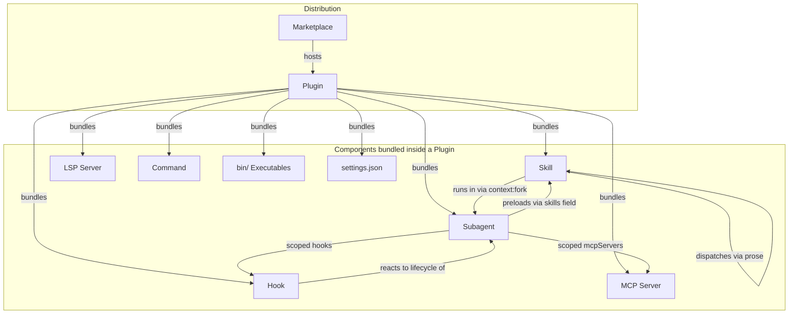
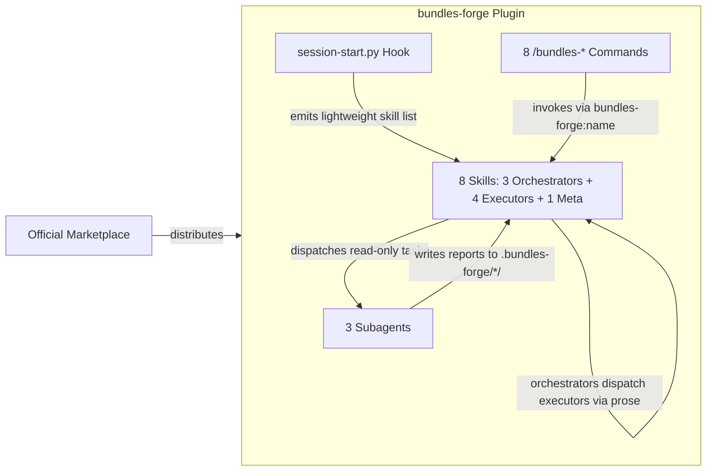

# Concepts Guide

[中文](concepts-guide.zh.md)

A guide to the building blocks of the Claude Code plugin ecosystem — and how bundles-forge uses them to create collaborative skill workflows.

Understanding these concepts helps you see why bundles-forge is designed the way it is, and gives you the vocabulary to build your own bundle-plugins confidently.

> **Canonical source:** This guide covers cross-cutting concepts that span multiple skills. For skill-specific details, see each skill's companion guide. The project architecture is summarized in `CLAUDE.md` and implemented across `skills/`.

---

## Component Taxonomy

Every plugin is a container that can bundle any combination of these components:



---

## Core Concepts

### Skill

**[Official docs](https://code.claude.com/docs/en/skills)** — The atomic capability unit.

A `SKILL.md` file with YAML frontmatter that the agent discovers by its `description` and loads on demand. Key frontmatter fields include `name`, `description`, `allowed-tools`, `model`, `effort`, `context`, `agent`, `hooks`, `paths`, `user-invocable`, and `disable-model-invocation`. Skills can run inline in the main conversation or in an isolated subagent via `context: fork` (optionally specifying which `agent` type to use). Skills chain to each other through prose instructions, not code APIs.

Skills support string substitutions (`$ARGUMENTS`, `$ARGUMENTS[N]`, `${CLAUDE_SKILL_DIR}`) and bash injection (`` !`command` ``) for dynamic context — shell commands execute before the skill content reaches the agent, and their output replaces the placeholder. Once invoked, a skill's content persists in the conversation until auto-compaction summarizes it.

**Example file:** `.claude/skills/auditing/SKILL.md`

```yaml
---
name: auditing
description: "Use when the user wants to audit a bundle-plugin project for quality and security issues."
allowed-tools: Read Grep Glob Bash
---
```

> **In bundles-forge:** 8 skills are organized in a hub-and-spoke model — 3 orchestrators (`blueprinting`, `optimizing`, `releasing`) dispatch 4 executors (`scaffolding`, `authoring`, `auditing`, `testing`) plus 1 bootstrap meta-skill. Orchestrators use the `bundles-forge:<name>` convention to dispatch executors via prose. See [How They Work Together](#how-they-work-together-in-bundles-forge).

### Plugin

**[Official docs](https://code.claude.com/docs/en/plugins)** — The packaging and distribution unit.

A directory containing `.claude-plugin/plugin.json` (manifest) plus any combination of skills, agents, hooks, MCP servers, LSP servers, commands, output styles, `bin/` executables (added to the Shell tool's PATH while the plugin is enabled), and a root-level `settings.json` for default configuration (currently supports the `agent` key to activate a custom subagent as the main thread). Plugins namespace their components (`/plugin-name:skill-name`) to avoid conflicts. Distributed via marketplaces.

**Example file:** `.claude-plugin/plugin.json`

```json
{
  "name": "bundles-forge",
  "version": "1.6.2",
  "description": "Bundle-plugin engineering toolkit"
}
```

> **In bundles-forge:** The project itself is a plugin with manifests for 6 platforms. It's also a toolkit for *building* other plugins — a bundle-plugin that builds bundle-plugins.

### Subagent

**[Official docs](https://code.claude.com/docs/en/sub-agents)** — A specialized AI assistant running in its own context window.

Subagents have a custom system prompt, tool restrictions, model selection, permission modes, scoped hooks, and scoped MCP servers. The main conversation delegates tasks to a subagent and receives only a summary back. Built-in subagents include Explore (read-only, Haiku), Plan (research for planning), and general-purpose (full tools). Custom subagents are defined as Markdown files in `agents/` with frontmatter fields like `tools`, `disallowedTools`, `model`, `permissionMode`, `memory`, `background`, `isolation`, `skills`, `mcpServers`, `hooks`, and `maxTurns`.

Subagents support persistent memory (`memory` field with `user`/`project`/`local` scopes), background execution, git worktree isolation (`isolation: worktree`), and can be resumed after completion. Users can invoke subagents via `@-mention` or run an entire session as a subagent with the `--agent` flag. For parallel multi-agent workflows across separate sessions, see [Agent Teams](https://code.claude.com/docs/en/agent-teams).

**Example file:** `agents/auditor.md`

> **In bundles-forge:** Three non-editing subagents — `inspector`, `auditor`, `evaluator` — are dispatched by skills for isolated validation work. They have `disallowedTools: Edit` so they cannot modify existing project files, but they do write new report files to `.bundles-forge/` subdirectories (`audits/`, `evals/`, `blueprints/`).
>
> **Design decision:** Users always interact through skills (slash commands), never by invoking agents directly. Skills orchestrate agent dispatch from the main conversation because they need pre/post logic (scope detection, report merging). Subagents cannot spawn other subagents — all orchestration stays in the skill layer.

### Hook

**[Official docs](https://code.claude.com/docs/en/hooks)** | **[Hooks guide](https://code.claude.com/docs/en/hooks-guide)** — A shell command, HTTP endpoint, or LLM prompt that executes automatically at specific lifecycle events.

26 lifecycle events span three cadences: once per session (`SessionStart`, `SessionEnd`), once per turn (`UserPromptSubmit`, `Stop`, `StopFailure`), and on every tool call inside the agentic loop (`PreToolUse`, `PostToolUse`, `PostToolUseFailure`). Additional events cover subagent lifecycle (`SubagentStart`, `SubagentStop`), task management (`TaskCreated`, `TaskCompleted`), permissions (`PermissionRequest`, `PermissionDenied`), file/config changes (`FileChanged`, `CwdChanged`, `ConfigChange`, `InstructionsLoaded`), context management (`PreCompact`, `PostCompact`), worktrees (`WorktreeCreate`, `WorktreeRemove`), MCP elicitation (`Elicitation`, `ElicitationResult`), agent teams (`TeammateIdle`), and notifications (`Notification`).

Four handler types are available: `command` (shell), `http` (POST to URL), `prompt` (LLM evaluation), and `agent` (agentic verifier with tools). Matcher groups filter events by tool name or regex, and an optional `if` field provides fine-grained conditional matching (e.g., `"if": "Bash(rm *)"` to match only specific commands). Hooks can block operations, inject context, or trigger side effects. Defined in `hooks/hooks.json`, settings files, or skill/agent frontmatter.

**Example file:** `hooks/hooks.json`

```json
{
  "description": "Bootstrap: emits lightweight skill list on session start",
  "hooks": {
    "SessionStart": [{
      "matcher": "startup|clear|compact",
      "hooks": [{
        "type": "command",
        "command": "python \"${CLAUDE_PLUGIN_ROOT}/hooks/session-start.py\"",
        "timeout": 10
      }]
    }]
  }
}
```

> **In bundles-forge:** The `session-start.py` hook emits a lightweight prompt listing all available skills. The full routing context (`using-bundles-forge/SKILL.md`) is loaded on demand via the platform's Skill tool. Written in Python for cross-platform compatibility.

### MCP (Model Context Protocol)

**[Official docs](https://code.claude.com/docs/en/mcp)** — An open standard for connecting Claude to external tools and data sources.

MCP servers provide tools, resources, and prompts via four transport types: `stdio`, `http`, `sse`, and `ws`. They are configured via `.mcp.json` and can be bundled inside plugins to start automatically. MCP servers can also be scoped to individual subagents via the `mcpServers` frontmatter field — the server connects when the subagent starts and disconnects when it finishes, keeping its tools out of the main conversation's context. Common use cases include databases, APIs, and issue trackers.

Not every external integration needs MCP — stateless, single-shot tools are better served by CLI executables in `bin/`. The `scaffolding` skill's `references/external-integration.md` provides a decision tree for choosing between CLI and MCP, covering both Claude Code and Cursor platforms.

> **In bundles-forge:** The toolkit doesn't ship its own MCP server, but the `auditing` skill checks target projects for MCP configuration security issues across 7 attack surfaces (skill content, hook scripts, hook configs (HTTP hooks), OpenCode plugins, agent prompts, bundled scripts, and MCP configs).

---

## Supplementary Concepts

### Command

**[Official docs](https://code.claude.com/docs/en/skills)** — Slash commands (`/deploy`, `/audit`) that invoke skills.

Commands have been merged into the skill system — a file at `.claude/commands/deploy.md` and a skill at `.claude/skills/deploy/SKILL.md` create the same `/deploy` command. Plugin `commands/` directories are still supported.

> **In bundles-forge:** 8 `/bundles-*` commands serve as thin entry points that redirect to the corresponding skill.

### Marketplace

**[Official docs](https://code.claude.com/docs/en/discover-plugins)** — A plugin catalog that hosts installable plugins.

Supports GitHub repos, Git URLs, local paths, and remote URLs. The official Anthropic marketplace is available by default; teams can create private marketplaces.

> **In bundles-forge:** Distributed through the official Anthropic marketplace (`/plugin install bundles-forge@bundles-forge-dev`).

### LSP Server

**[Official docs](https://code.claude.com/docs/en/plugins-reference#lsp-servers)** — Language Server Protocol integration that gives Claude real-time code intelligence.

Provides diagnostics after edits, go-to-definition, find-references, and hover information. Configured via `.lsp.json` in the plugin.

> **In bundles-forge:** Not used — the toolkit focuses on skill/plugin engineering rather than language-specific code intelligence.

### bin/ Directory

**[Official docs](https://code.claude.com/docs/en/plugins-reference#plugin-directory-structure)** — Plugin executables added to the Bash tool's `PATH` while the plugin is enabled.

Useful for shipping CLI helpers, formatters, or validators that skills and hooks can call without absolute paths.

> **In bundles-forge:** Not used — the toolkit relies on Python scripts in `skills/auditing/scripts/` and `skills/releasing/scripts/`, plus inline shell commands.

### Plugin Settings (settings.json)

**[Official docs](https://code.claude.com/docs/en/plugins-reference#plugin-directory-structure)** — Default settings applied when the plugin is enabled.

A `settings.json` at the plugin root. Currently only the `agent` key is supported, which activates one of the plugin's custom subagents as the main thread (applying its system prompt, tool restrictions, and model).

> **In bundles-forge:** Not used — skills are invoked on demand, not through a session-wide default agent.

### Output Style

**[Official docs](https://code.claude.com/docs/en/plugins-reference#plugin-directory-structure)** — Custom response formatting directives stored in `output-styles/`.

Changes how Claude presents its output (e.g., concise mode, structured reports).

> **In bundles-forge:** Not used.

---

## Key Distinctions

Concepts in the plugin ecosystem can be confusing at first. This section clarifies the boundaries between similar-sounding terms.

### Skill vs Command

| | Skill | Command |
|---|---|---|
| **What it is** | A capability unit with instructions and tool permissions | A slash-command alias that invokes a skill |
| **File location** | `skills/<name>/SKILL.md` | `commands/<name>.md` |
| **Discovery** | Agent matches user intent against `description` field | User types `/command-name` explicitly |
| **Can exist alone?** | Yes — skills work without a command | No — commands must point to a skill |

**Why both exist:** Skills are the real workers; commands are just convenience shortcuts for users who prefer explicit invocation. Not every skill needs a command — executor skills may be dispatched by orchestrator skills rather than invoked directly by users.

### Skill (inline) vs Skill (context:fork)

| | Inline (`context: main`) | Isolated (`context: fork`) |
|---|---|---|
| **Runs in** | The main conversation | A new subagent context |
| **Sees** | Full conversation history | Only the skill's system prompt + delegated task |
| **Can edit files?** | Depends on `allowed-tools` | Depends on subagent config |
| **Use when** | The skill needs conversation context or user interaction | The task is self-contained and benefits from isolation |

**In bundles-forge:** All 8 skills run inline (they need to interact with the user and dispatch or be dispatched by other skills). The 3 agents run in forked contexts (they perform isolated diagnostic tasks and return reports).

### Hook vs Subagent

| | Hook | Subagent |
|---|---|---|
| **Triggered by** | Lifecycle events (automatic) | Explicit dispatch from a skill or the agent |
| **Execution model** | Shell command / HTTP call / LLM prompt | Full AI agent with its own context window |
| **Duration** | Short — runs and returns | Can be long — performs multi-step reasoning |
| **Can reason?** | If `type: prompt` or `type: agent` | Yes — it's a full AI agent |
| **Output** | stdout/stderr injected into context | Summary message returned to parent |

**Key insight:** Hooks are reactive automation (fire-and-forget on events), while subagents are delegated intelligence (given a task, reason through it, report back).

### Plugin vs Bundle-Plugin

| | Plugin | Bundle-Plugin |
|---|---|---|
| **Skills** | 1 or more, possibly independent | 3+ skills that form a workflow |
| **Integration** | Skills don't reference each other | Skills explicitly dispatch via `project:skill-name` |
| **Lifecycle** | No defined order | Hub-and-spoke: orchestrators dispatch executors (e.g., blueprinting dispatches scaffolding, authoring, auditing) |
| **Example** | A single code-review skill | bundles-forge (8 skills in a hub-and-spoke model) |

**The distinction matters because** bundle-plugins need engineering infrastructure that single-skill plugins don't: cross-reference validation, workflow integrity checks, version synchronization across manifests, and coordinated quality gates. That's what bundles-forge provides.

---

## Design Decisions

These explain *why* bundles-forge is built the way it is — not just *what* it does.

### Why do skills dispatch through prose, not code APIs?

Skills are Markdown files loaded into an AI agent's context. They don't have a runtime, an event bus, or function imports. The only communication channel between skills is the agent itself — one skill tells the agent "now invoke `bundles-forge:scaffolding`" in plain text, and the agent's platform-level skill-loading tool handles the rest.

This is not a limitation — it's the fundamental architecture of the plugin ecosystem. Skills are **instructions for an AI**, not code modules for a compiler. Prose dispatch means:

- **Zero coupling** — skills don't import each other or share state
- **Platform portable** — the same dispatch works across Claude Code, Cursor, Codex, etc., each using its own skill-loading mechanism
- **Human readable** — anyone can read a SKILL.md and understand the full workflow without tracing code

### Why are subagents non-editing?

The three bundles-forge subagents (`inspector`, `auditor`, `evaluator`) all have `disallowedTools: Edit`. They can write new report files to `.bundles-forge/` subdirectories (`audits/`, `evals/`, `blueprints/`), but they cannot modify any existing project file. This is deliberate:

- **Separation of concerns** — agents assess, skills act. An auditor that can fix what it finds would conflate the roles.
- **Trust boundary** — audit reports should be objective. If the auditor could modify project files, its findings could be questioned ("did it just pass because it silently fixed the issue?").
- **Predictability** — users invoke `/bundles-audit` expecting a report, not surprise changes to their code.

The skill or user that dispatches the agent is responsible for acting on the report — offering to fix issues, re-running the audit, or invoking the appropriate orchestrator.

### Why do users interact through skills, not agents?

Subagents can't spawn other subagents. If users invoked agents directly:

- The agent couldn't chain to other skills after finishing
- There would be no pre-processing (scope detection, target path resolution)
- There would be no post-processing (report merging, re-audit offers, workflow routing)

Skills handle the interaction lifecycle: detect what the user wants → dispatch the right agent → collect results → present findings → offer next steps. Within skills, **orchestrators** (`blueprinting`, `optimizing`, `releasing`) manage multi-step pipelines, while **executors** (`scaffolding`, `authoring`, `auditing`, `testing`) perform focused tasks. Subagents are **diagnostic tools** — they do one non-editing job (writing reports to `.bundles-forge/` subdirectories, never modifying existing files) and return a summary.

**Concrete example — two-phase workflow audit:** The `auditing` skill needs both the `auditor` (static checks W1-W9) and the `evaluator` (behavioral verification W10-W11). Since subagents cannot spawn other subagents, the `auditing` skill dispatches them sequentially from the main conversation: Phase 1 sends the `auditor`, waits for its report, then Phase 2 sends the `evaluator` with context from Phase 1. This two-phase orchestration is only possible because a skill — not a subagent — owns the workflow.

### Why does session-start.py emit a lightweight prompt instead of injecting the full skill context?

The `session-start.py` hook emits a one-line prompt (~120 bytes) listing available skill names, rather than injecting the full `using-bundles-forge/SKILL.md` (~6KB). The full routing context is loaded on demand when a skill is first invoked. This design was chosen for three reasons:

- **Context window economy** — ~120 bytes vs ~6KB per session. The lightweight prompt reserves context budget for user work while still providing enough information for routing.
- **Routing accuracy** — the prompt lists all skill names, so the agent can match user intent to the correct orchestrator or executor. Detailed routing tables are loaded only when needed.
- **Fail-safe** — if the hook fails, the agent still works (users can invoke skills manually via `bundles-forge:<skill-name>`).

---

## How They Work Together in bundles-forge



1. **Marketplace** distributes the plugin — users install with `/plugin install bundles-forge@bundles-forge-dev`
2. **Hook** fires at session start — emits a lightweight skill list so the agent knows what's available
3. **Commands** provide explicit entry points — `/bundles-audit` routes to the `auditing` skill
4. **Skills** do the work — orchestrators manage pipelines and dispatch executors; executors perform focused tasks
5. **Subagents** handle isolated tasks — auditing, inspection, A/B evaluation — and write reports to `.bundles-forge/` subdirectories (`audits/`, `evals/`, `blueprints/`)

---

## Further Reading

### Claude Code Official Documentation

| Topic | Link |
|-------|------|
| Skills | [code.claude.com/docs/en/skills](https://code.claude.com/docs/en/skills) |
| Plugins | [code.claude.com/docs/en/plugins](https://code.claude.com/docs/en/plugins) |
| Subagents | [code.claude.com/docs/en/sub-agents](https://code.claude.com/docs/en/sub-agents) |
| Hooks Reference | [code.claude.com/docs/en/hooks](https://code.claude.com/docs/en/hooks) |
| Hooks Guide | [code.claude.com/docs/en/hooks-guide](https://code.claude.com/docs/en/hooks-guide) |
| MCP | [code.claude.com/docs/en/mcp](https://code.claude.com/docs/en/mcp) |
| Plugin Reference | [code.claude.com/docs/en/plugins-reference](https://code.claude.com/docs/en/plugins-reference) |
| Discover Plugins | [code.claude.com/docs/en/discover-plugins](https://code.claude.com/docs/en/discover-plugins) |

### bundles-forge Internal Documentation

| Guide | Purpose |
|-------|---------|
| [Blueprinting Guide](blueprinting-guide.md) | Scenario selection, interview walkthrough, design decisions |
| [Scaffolding Guide](scaffolding-guide.md) | Project generation, platform adaptation, inspector validation |
| [Authoring Guide](authoring-guide.md) | Skill writing, agent authoring, quality checklists |
| [Auditing Guide](auditing-guide.md) | Audit scopes, checklists, report templates, CI integration |
| [Optimizing Guide](optimizing-guide.md) | 8 optimization targets, A/B evaluation, feedback iteration |
| [Releasing Guide](releasing-guide.md) | Release pipeline, version management, publishing |
