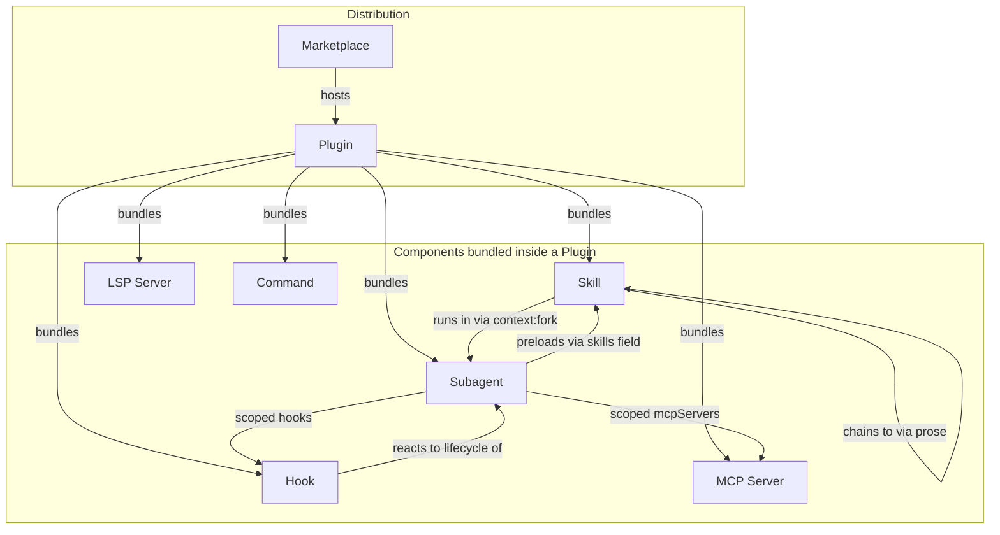
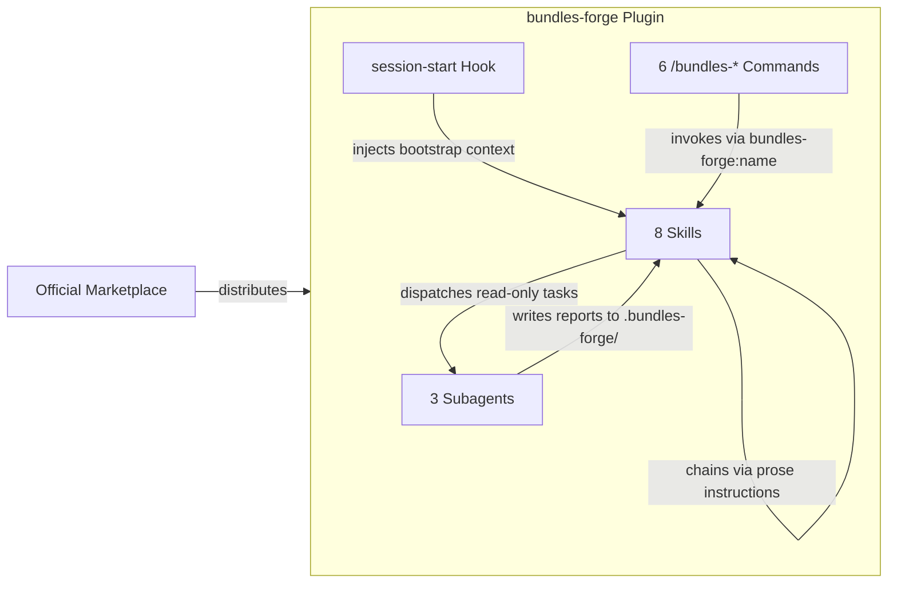

# Concepts Guide

[中文](concepts-guide.zh.md)

A guide to the building blocks of the Claude Code plugin ecosystem — and how bundles-forge uses them to create collaborative skill workflows.

Understanding these concepts helps you see why bundles-forge is designed the way it is, and gives you the vocabulary to build your own bundle-plugins confidently.

---

## Component Taxonomy

Every plugin is a container that can bundle any combination of these components:



---

## Core Concepts

### Skill

**[Official docs](https://code.claude.com/docs/en/skills)** — The atomic capability unit.

A `SKILL.md` file with YAML frontmatter (`name`, `description`, `allowed-tools`, etc.) that the agent discovers by its `description` and loads on demand. Skills can run inline in the main conversation or in an isolated subagent via `context: fork`. Skills chain to each other through prose instructions, not code APIs.

**Example file:** `.claude/skills/auditing/SKILL.md`

```yaml
---
name: auditing
description: "Use when the user wants to audit a bundle-plugin project for quality and security issues."
allowed-tools: Read, Grep, Glob, Shell
---
```

> **In bundles-forge:** 8 skills form a lifecycle workflow — each skill's instructions tell the agent which skill to invoke next using the `bundles-forge:<name>` convention. See [How They Work Together](#how-they-work-together-in-bundles-forge).

### Plugin

**[Official docs](https://code.claude.com/docs/en/plugins)** — The packaging and distribution unit.

A directory containing `.claude-plugin/plugin.json` (manifest) plus any combination of skills, agents, hooks, MCP servers, LSP servers, commands, and output styles. Plugins namespace their components (`/plugin-name:skill-name`) to avoid conflicts. Distributed via marketplaces.

**Example file:** `.claude-plugin/plugin.json`

```json
{
  "name": "bundles-forge",
  "version": "1.5.3",
  "description": "Bundle-plugin engineering toolkit"
}
```

> **In bundles-forge:** The project itself is a plugin with manifests for 5 platforms. It's also a toolkit for *building* other plugins — a bundle-plugin that builds bundle-plugins.

### Subagent

**[Official docs](https://code.claude.com/docs/en/sub-agents)** — A specialized AI assistant running in its own context window.

Subagents have a custom system prompt, tool restrictions, and model selection. The main conversation delegates tasks to a subagent and receives only a summary back. Built-in subagents include Explore (read-only, fast), Plan (research for planning), and general-purpose (full tools). Custom subagents are defined as Markdown files in `agents/`.

**Example file:** `agents/auditor.md`

> **In bundles-forge:** Three read-only subagents — `inspector`, `auditor`, `evaluator` — are dispatched by skills for isolated validation work.
>
> **Design decision:** Users always interact through skills (slash commands), never by invoking agents directly. Skills orchestrate agent dispatch from the main conversation because they need pre/post logic (scope detection, report merging). Subagents cannot spawn other subagents — all orchestration stays in the skill layer.

### Hook

**[Official docs](https://code.claude.com/docs/en/hooks)** — A shell command, HTTP endpoint, or LLM prompt that executes automatically at specific lifecycle events.

Events include `SessionStart`, `PreToolUse`, `PostToolUse`, `Stop`, `SubagentStart`, etc. Hooks can block operations, inject context, or trigger side effects. Defined in `hooks/hooks.json` or settings.

**Example file:** `hooks/hooks.json`

```json
{
  "hooks": {
    "SessionStart": [{
      "type": "command",
      "command": "./hooks/session-start"
    }]
  }
}
```

> **In bundles-forge:** The `session-start` hook reads the bootstrap skill and injects it into the agent's context, giving it awareness of all available skills at the start of every session.

### MCP (Model Context Protocol)

**[Official docs](https://code.claude.com/docs/en/mcp)** — An open standard for connecting Claude to external tools and data sources.

MCP servers provide tools, resources, and prompts. They are configured via `.mcp.json` and can be bundled inside plugins to start automatically. Common use cases include databases, APIs, and issue trackers.

> **In bundles-forge:** The toolkit doesn't ship its own MCP server, but the `auditing` skill checks target projects for MCP configuration security issues across 5 attack surfaces.

---

## Supplementary Concepts

### Command

**[Official docs](https://code.claude.com/docs/en/skills)** — Slash commands (`/deploy`, `/audit`) that invoke skills.

Commands have been merged into the skill system — a file at `.claude/commands/deploy.md` and a skill at `.claude/skills/deploy/SKILL.md` create the same `/deploy` command. Plugin `commands/` directories are still supported.

> **In bundles-forge:** 6 `/bundles-*` commands serve as thin entry points that redirect to the corresponding skill.

### Marketplace

**[Official docs](https://code.claude.com/docs/en/discover-plugins)** — A plugin catalog that hosts installable plugins.

Supports GitHub repos, Git URLs, local paths, and remote URLs. The official Anthropic marketplace is available by default; teams can create private marketplaces.

> **In bundles-forge:** Distributed through the official Anthropic marketplace (`claude plugin install bundles-forge`).

### LSP Server

**[Official docs](https://code.claude.com/docs/en/plugins-reference#lsp-servers)** — Language Server Protocol integration that gives Claude real-time code intelligence.

Provides diagnostics after edits, go-to-definition, find-references, and hover information. Configured via `.lsp.json` in the plugin.

> **In bundles-forge:** Not used — the toolkit focuses on skill/plugin engineering rather than language-specific code intelligence.

### Output Style

**[Official docs](https://code.claude.com/docs/en/plugins-reference#plugin-directory-structure)** — Custom response formatting directives stored in `output-styles/`.

Changes how Claude presents its output (e.g., concise mode, structured reports).

> **In bundles-forge:** Not used.

---

## Key Distinctions

Concepts in the plugin ecosystem can be confusing at first. This section clarifies the boundaries between similar-sounding terms.

### Skill vs Command

| | Skill | Command |
|---|---|---|
| **What it is** | A capability unit with instructions and tool permissions | A slash-command alias that invokes a skill |
| **File location** | `skills/<name>/SKILL.md` | `commands/<name>.md` |
| **Discovery** | Agent matches user intent against `description` field | User types `/command-name` explicitly |
| **Can exist alone?** | Yes — skills work without a command | No — commands must point to a skill |

**Why both exist:** Skills are the real workers; commands are just convenience shortcuts for users who prefer explicit invocation. Not every skill needs a command — some are only invoked by other skills via chaining.

### Skill (inline) vs Skill (context:fork)

| | Inline (`context: main`) | Isolated (`context: fork`) |
|---|---|---|
| **Runs in** | The main conversation | A new subagent context |
| **Sees** | Full conversation history | Only the skill's system prompt + delegated task |
| **Can edit files?** | Depends on `allowed-tools` | Depends on subagent config |
| **Use when** | The skill needs conversation context or user interaction | The task is self-contained and benefits from isolation |

**In bundles-forge:** All 8 skills run inline (they need to interact with the user and chain to other skills). The 3 agents run in forked contexts (they perform isolated validation and return reports).

### Hook vs Subagent

| | Hook | Subagent |
|---|---|---|
| **Triggered by** | Lifecycle events (automatic) | Explicit dispatch from a skill or the agent |
| **Execution model** | Shell command / HTTP call / LLM prompt | Full AI agent with its own context window |
| **Duration** | Short — runs and returns | Can be long — performs multi-step reasoning |
| **Can reason?** | Only if `type: prompt` | Yes — it's a full AI agent |
| **Output** | stdout/stderr injected into context | Summary message returned to parent |

**Key insight:** Hooks are reactive automation (fire-and-forget on events), while subagents are delegated intelligence (given a task, reason through it, report back).

### Plugin vs Bundle-Plugin

| | Plugin | Bundle-Plugin |
|---|---|---|
| **Skills** | 1 or more, possibly independent | 3+ skills that form a workflow |
| **Chaining** | Skills don't reference each other | Skills explicitly chain via `project:skill-name` |
| **Lifecycle** | No defined order | Clear sequence (e.g., design → scaffold → audit) |
| **Example** | A single code-review skill | bundles-forge (8 skills in a lifecycle pipeline) |

**The distinction matters because** bundle-plugins need engineering infrastructure that single-skill plugins don't: cross-reference validation, workflow integrity checks, version synchronization across manifests, and coordinated quality gates. That's what bundles-forge provides.

---

## Design Decisions

These explain *why* bundles-forge is built the way it is — not just *what* it does.

### Why do skills chain through prose, not code APIs?

Skills are Markdown files loaded into an AI agent's context. They don't have a runtime, an event bus, or function imports. The only communication channel between skills is the agent itself — one skill tells the agent "now invoke `bundles-forge:scaffolding`" in plain text, and the agent's platform-level skill-loading tool handles the rest.

This is not a limitation — it's the fundamental architecture of the plugin ecosystem. Skills are **instructions for an AI**, not code modules for a compiler. Prose chaining means:

- **Zero coupling** — skills don't import each other or share state
- **Platform portable** — the same chain works across Claude Code, Cursor, Codex, etc., each using its own skill-loading mechanism
- **Human readable** — anyone can read a SKILL.md and understand the full workflow without tracing code

### Why are subagents read-only?

The three bundles-forge subagents (`inspector`, `auditor`, `evaluator`) all have `disallowedTools: Edit`. This is deliberate:

- **Separation of concerns** — agents assess, skills act. An auditor that can fix what it finds would conflate the roles.
- **Trust boundary** — audit reports should be objective. If the auditor could modify files, its findings could be questioned ("did it just pass because it silently fixed the issue?").
- **Predictability** — users invoke `/bundles-audit` expecting a report, not surprise file changes.

The skill that dispatches the agent is responsible for acting on the report — offering to fix issues, re-running the audit, or chaining to `optimizing`.

### Why do users interact through skills, not agents?

Subagents can't spawn other subagents. If users invoked agents directly:

- The agent couldn't chain to other skills after finishing
- There would be no pre-processing (scope detection, target path resolution)
- There would be no post-processing (report merging, re-audit offers, workflow routing)

Skills are **orchestrators**. They handle the full interaction lifecycle: detect what the user wants → dispatch the right agent → collect results → present findings → offer next steps. Agents are **executors** — they do one focused job and return.

### Why does session-start inject the full skill inventory?

The `session-start` hook reads `using-bundles-forge/SKILL.md` and injects it into the agent's context at the start of every session. An alternative would be lazy loading — only load skills when needed. But:

- **Routing accuracy** — the agent needs to know *all* available skills to match user intent correctly. If it only knew about `auditing`, it couldn't suggest `optimizing` when audit findings need iteration.
- **Cost is low** — the bootstrap skill is compact (~2KB of context). The per-skill SKILL.md files are only loaded when actually invoked.
- **Fail-safe** — if the hook fails, the agent still works (users can invoke skills manually). If lazy loading failed, the agent would be blind to all skills.

---

## How They Work Together in bundles-forge



1. **Marketplace** distributes the plugin — users install with `claude plugin install bundles-forge`
2. **Hook** fires at session start — injects the skill inventory so the agent knows what's available
3. **Commands** provide explicit entry points — `/bundles-audit` routes to the `auditing` skill
4. **Skills** do the work — they interact with the user, dispatch agents, and chain to the next skill
5. **Subagents** handle isolated tasks — auditing, inspection, A/B evaluation — and write reports to `.bundles-forge/`

---

## Further Reading

### Claude Code Official Documentation

| Topic | Link |
|-------|------|
| Skills | [code.claude.com/docs/en/skills](https://code.claude.com/docs/en/skills) |
| Plugins | [code.claude.com/docs/en/plugins](https://code.claude.com/docs/en/plugins) |
| Subagents | [code.claude.com/docs/en/sub-agents](https://code.claude.com/docs/en/sub-agents) |
| Hooks | [code.claude.com/docs/en/hooks](https://code.claude.com/docs/en/hooks) |
| MCP | [code.claude.com/docs/en/mcp](https://code.claude.com/docs/en/mcp) |
| Plugin Reference | [code.claude.com/docs/en/plugins-reference](https://code.claude.com/docs/en/plugins-reference) |
| Discover Plugins | [code.claude.com/docs/en/discover-plugins](https://code.claude.com/docs/en/discover-plugins) |

### bundles-forge Internal Documentation

| Guide | Purpose |
|-------|---------|
| [Blueprinting Guide](blueprinting-guide.md) | Scenario selection, interview walkthrough, design decisions |
| [Auditing Guide](auditing-guide.md) | Audit scopes, checklists, report templates, CI integration |
| [Optimizing Guide](optimizing-guide.md) | 6 optimization targets, A/B evaluation, feedback iteration |
| [Releasing Guide](releasing-guide.md) | Release pipeline, version management, publishing |
