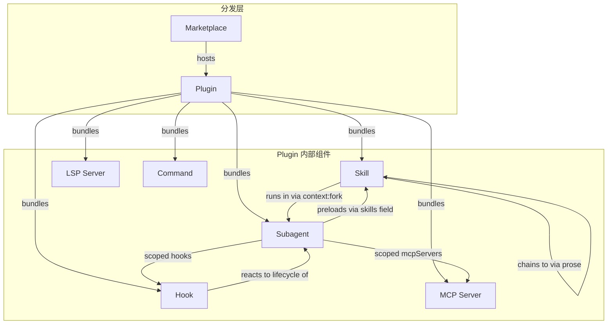
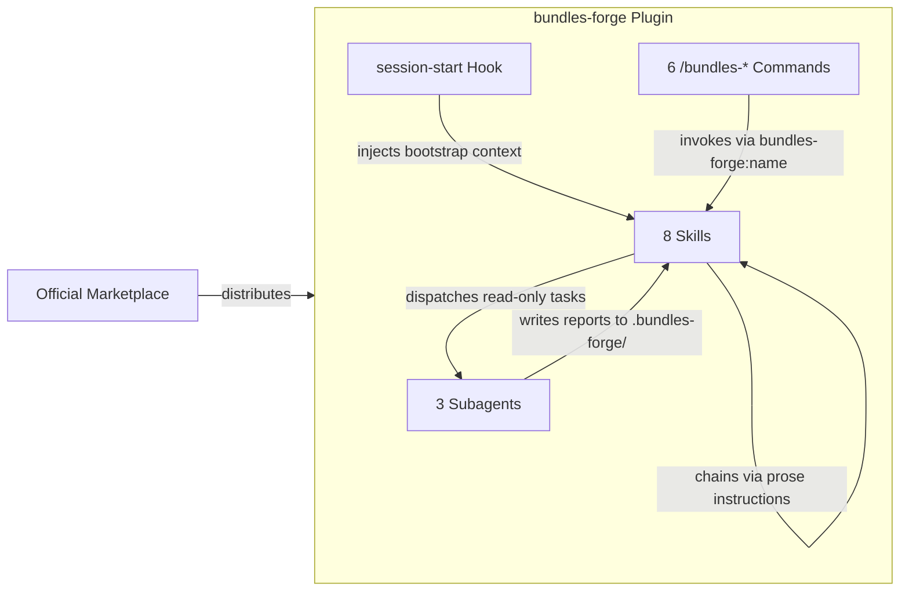

# 概念指南

[English](concepts-guide.md)

Claude Code 插件生态的构建块详解 — 以及 bundles-forge 如何利用它们创建协作式技能工作流。

理解这些概念有助于看清 bundles-forge 的设计逻辑，也为你自信地构建自己的 bundle-plugin 提供必要的词汇表。

---

## 组件分类

每个插件都是一个容器，可以捆绑以下任意组合的组件：



---

## 核心概念

### Skill（技能）

**[官方文档](https://code.claude.com/docs/en/skills)** — 原子能力单元。

一个 `SKILL.md` 文件加 YAML frontmatter（`name`、`description`、`allowed-tools` 等），Agent 通过 `description` 自动发现并按需加载。技能可以在主对话中内联运行，也可以通过 `context: fork` 在隔离的子代理中运行。技能之间通过文字指令（而非代码 API）链式调用。

**示例文件：** `.claude/skills/auditing/SKILL.md`

```yaml
---
name: auditing
description: "Use when the user wants to audit a bundle-plugin project for quality and security issues."
allowed-tools: Read, Grep, Glob, Shell
---
```

> **在 bundles-forge 中：** 8 个技能组成生命周期工作流 — 每个技能在指令中用 `bundles-forge:<name>` 约定告知 Agent 下一步调用哪个技能。详见[在 bundles-forge 中的协作方式](#在-bundles-forge-中的协作方式)。

### Plugin（插件）

**[官方文档](https://code.claude.com/docs/en/plugins)** — 打包分发单元。

一个包含 `.claude-plugin/plugin.json`（清单）的目录，可组合技能、Agent、钩子、MCP 服务器、LSP 服务器、命令和输出风格。插件对组件进行命名空间化（`/plugin-name:skill-name`）以避免冲突，通过 marketplace 分发。

**示例文件：** `.claude-plugin/plugin.json`

```json
{
  "name": "bundles-forge",
  "version": "1.5.3",
  "description": "Bundle-plugin engineering toolkit"
}
```

> **在 bundles-forge 中：** 项目自身就是一个拥有 5 个平台清单的插件，同时也是*构建*其他插件的工具包 — 一个用来造 bundle-plugin 的 bundle-plugin。

### Subagent（子代理）

**[官方文档](https://code.claude.com/docs/en/sub-agents)** — 运行在独立上下文窗口中的专用 AI 助手。

子代理拥有自定义系统提示词、工具权限和模型选择。主对话将任务委托给子代理，只接收摘要。内置子代理包括 Explore（只读、快速）、Plan（研究规划用）和 general-purpose（完整工具）。自定义子代理以 Markdown 文件形式定义在 `agents/` 目录。

**示例文件：** `agents/auditor.md`

> **在 bundles-forge 中：** 三个只读子代理 — `inspector`、`auditor`、`evaluator` — 由技能派遣执行隔离的验证工作。
>
> **设计决策：** 用户始终通过技能（斜杠命令）交互，不直接调用 agent。技能在主对话中编排 agent 派遣，因为需要前置/后置逻辑（范围检测、报告合并）。子代理不可嵌套派遣其他子代理 — 所有编排权必须保留在技能层。

### Hook（钩子）

**[官方文档](https://code.claude.com/docs/en/hooks)** — 在特定生命周期事件上自动执行的 shell 命令、HTTP 端点或 LLM prompt。

事件包括 `SessionStart`、`PreToolUse`、`PostToolUse`、`Stop`、`SubagentStart` 等。钩子可以拦截操作、注入上下文或触发副作用。定义在 `hooks/hooks.json` 或设置中。

**示例文件：** `hooks/hooks.json`

```json
{
  "hooks": {
    "SessionStart": [{
      "type": "command",
      "command": "./hooks/session-start"
    }]
  }
}
```

> **在 bundles-forge 中：** `session-start` 钩子读取引导技能并注入 Agent 上下文，使其在每个会话开始时就获得所有可用技能的信息。

### MCP（Model Context Protocol）

**[官方文档](https://code.claude.com/docs/en/mcp)** — 连接 Claude 与外部工具和数据源的开放标准。

MCP 服务器提供工具、资源和提示词，通过 `.mcp.json` 配置，可以捆绑在插件中自动启动。常见用例包括数据库、API 和问题追踪器。

> **在 bundles-forge 中：** 工具包本身不自带 MCP 服务器，但 `auditing` 技能会检查目标项目的 MCP 配置安全性，覆盖 5 大攻击面。

---

## 补充概念

### Command（命令）

**[官方文档](https://code.claude.com/docs/en/skills)** — 斜杠命令（`/deploy`、`/audit`）用于调用技能。

命令已合并入技能体系 — `.claude/commands/deploy.md` 和 `.claude/skills/deploy/SKILL.md` 创建相同的 `/deploy` 命令。插件的 `commands/` 目录仍然受支持。

> **在 bundles-forge 中：** 6 个 `/bundles-*` 命令作为薄入口，重定向到对应的技能。

### Marketplace（市场）

**[官方文档](https://code.claude.com/docs/en/discover-plugins)** — 托管可安装插件的目录/市场。

支持 GitHub 仓库、Git URL、本地路径和远程 URL。官方 Anthropic 市场默认可用，团队也可创建私有市场。

> **在 bundles-forge 中：** 通过官方 Anthropic 市场分发（`claude plugin install bundles-forge`）。

### LSP Server

**[官方文档](https://code.claude.com/docs/en/plugins-reference#lsp-servers)** — Language Server Protocol 集成，为 Claude 提供实时代码智能。

提供编辑后诊断、跳转定义、查找引用和悬停信息。通过插件中的 `.lsp.json` 配置。

> **在 bundles-forge 中：** 未使用 — 工具包聚焦于技能/插件工程，而非语言相关的代码智能。

### Output Style（输出风格）

**[官方文档](https://code.claude.com/docs/en/plugins-reference#plugin-directory-structure)** — 存储在 `output-styles/` 中的自定义响应格式指令。

改变 Claude 呈现输出的方式（如简洁模式、结构化报告）。

> **在 bundles-forge 中：** 未使用。

---

## 容易混淆的概念辨析

插件生态中的概念初看可能让人困惑。本节厘清容易混淆的术语之间的边界。

### Skill vs Command

| | Skill | Command |
|---|---|---|
| **是什么** | 带指令和工具权限的能力单元 | 调用 skill 的斜杠命令别名 |
| **文件位置** | `skills/<name>/SKILL.md` | `commands/<name>.md` |
| **发现方式** | Agent 将用户意图与 `description` 字段匹配 | 用户显式输入 `/command-name` |
| **可以独立存在？** | 是 — skill 不需要 command 也能工作 | 否 — command 必须指向一个 skill |

**为什么两者并存：** Skill 是真正的执行者；command 只是为偏好显式调用的用户提供的快捷方式。并非每个 skill 都需要 command — 有些 skill 仅由其他 skill 通过链式调用触发。

### Skill（内联） vs Skill（context:fork）

| | 内联（`context: main`） | 隔离（`context: fork`） |
|---|---|---|
| **运行位置** | 主对话 | 新的子代理上下文 |
| **可见范围** | 完整对话历史 | 仅技能的系统提示词 + 委托的任务 |
| **可以编辑文件？** | 取决于 `allowed-tools` | 取决于子代理配置 |
| **适用场景** | 技能需要对话上下文或用户交互 | 任务自包含且受益于隔离执行 |

**在 bundles-forge 中：** 全部 8 个技能内联运行（它们需要与用户交互并链式调用其他技能）。3 个 agent 在 fork 上下文中运行（执行隔离验证并返回报告）。

### Hook vs Subagent

| | Hook | Subagent |
|---|---|---|
| **触发方式** | 生命周期事件（自动） | 由技能或 agent 显式派遣 |
| **执行模型** | Shell 命令 / HTTP 调用 / LLM prompt | 拥有独立上下文窗口的完整 AI agent |
| **持续时间** | 短 — 执行后返回 | 可以很长 — 执行多步推理 |
| **可以推理？** | 仅当 `type: prompt` 时 | 是 — 它是完整的 AI agent |
| **输出** | stdout/stderr 注入上下文 | 摘要消息返回给父级 |

**关键区别：** Hook 是响应式自动化（在事件上触发后即忘），Subagent 是委托式智能（给定任务、推理、汇报）。

### Plugin vs Bundle-Plugin

| | Plugin | Bundle-Plugin |
|---|---|---|
| **技能数量** | 1 个或多个，可能相互独立 | 3 个以上组成工作流的技能 |
| **链式调用** | 技能之间不互相引用 | 技能通过 `project:skill-name` 显式链接 |
| **生命周期** | 无固定顺序 | 明确的流程（如 设计 → 搭建 → 审计） |
| **示例** | 单个代码审查技能 | bundles-forge（8 个技能组成生命周期流水线） |

**这个区分很重要，因为** bundle-plugin 需要单技能插件不需要的工程基础设施：交叉引用验证、工作流完整性检查、跨清单版本同步、以及协调的质量关卡。这正是 bundles-forge 提供的价值。

---

## 设计决策

以下内容解释 bundles-forge *为什么*这样设计 — 不仅仅是*做了什么*。

### 为什么技能之间通过文字指令链式调用，而非代码 API？

技能是加载到 AI Agent 上下文中的 Markdown 文件。它们没有运行时、事件总线或函数导入。技能之间唯一的通信通道是 Agent 本身 — 一个技能用纯文本告诉 Agent "现在调用 `bundles-forge:scaffolding`"，由 Agent 的平台级技能加载工具处理其余部分。

这不是局限 — 这是插件生态的根本架构。技能是**给 AI 的指令**，不是给编译器的代码模块。文字链式调用意味着：

- **零耦合** — 技能之间不互相导入、不共享状态
- **跨平台可移植** — 同样的链路在 Claude Code、Cursor、Codex 等平台上都能工作，各自使用自己的技能加载机制
- **人类可读** — 任何人都能阅读 SKILL.md 并理解完整工作流，无需追踪代码

### 为什么子代理是只读的？

bundles-forge 的三个子代理（`inspector`、`auditor`、`evaluator`）都设置了 `disallowedTools: Edit`。这是刻意为之：

- **关注点分离** — agent 负责评估，skill 负责行动。一个能修复自己发现的问题的审计器会混淆角色。
- **信任边界** — 审计报告应当客观。如果审计器能修改文件，其结论可能被质疑（"它是不是偷偷修了问题才通过的？"）。
- **可预期性** — 用户执行 `/bundles-audit` 时期望得到报告，而非意外的文件更改。

派遣 agent 的技能负责对报告采取行动 — 提供修复建议、重新运行审计、或链式调用 `optimizing`。

### 为什么用户通过技能交互，而非直接调用 agent？

子代理不能派遣其他子代理。如果用户直接调用 agent：

- agent 完成后无法链式调用其他技能
- 没有前置处理（范围检测、目标路径解析）
- 没有后置处理（报告合并、重审提议、工作流路由）

技能是**编排者**。它们处理完整的交互生命周期：检测用户意图 → 派遣正确的 agent → 收集结果 → 呈现发现 → 提供下一步。Agent 是**执行者** — 它们完成一项聚焦的工作并返回。

### 为什么 session-start 注入完整的技能清单？

`session-start` 钩子在每个会话开始时读取 `using-bundles-forge/SKILL.md` 并注入 Agent 上下文。替代方案是延迟加载 — 按需加载技能。但是：

- **路由准确性** — Agent 需要知道*所有*可用技能才能正确匹配用户意图。如果它只知道 `auditing`，就无法在审计发现需要迭代时建议 `optimizing`。
- **成本极低** — 引导技能非常紧凑（约 2KB 上下文）。各技能的 SKILL.md 只在实际调用时才加载。
- **容错性** — 如果钩子失败，Agent 仍然可以工作（用户可以手动调用技能）。如果延迟加载失败，Agent 将对所有技能一无所知。

---

## 在 bundles-forge 中的协作方式



1. **Marketplace** 分发插件 — 用户通过 `claude plugin install bundles-forge` 安装
2. **Hook** 在会话启动时触发 — 注入技能清单使 Agent 感知所有可用技能
3. **Command** 提供显式入口 — `/bundles-audit` 路由到 `auditing` 技能
4. **Skill** 执行工作 — 与用户交互、派遣 agent、链式调用下一个技能
5. **Subagent** 处理隔离任务 — 审计、检查、A/B 评估 — 并将报告写入 `.bundles-forge/`

---

## 延伸阅读

### Claude Code 官方文档

| 主题 | 链接 |
|------|------|
| Skills | [code.claude.com/docs/en/skills](https://code.claude.com/docs/en/skills) |
| Plugins | [code.claude.com/docs/en/plugins](https://code.claude.com/docs/en/plugins) |
| Subagents | [code.claude.com/docs/en/sub-agents](https://code.claude.com/docs/en/sub-agents) |
| Hooks | [code.claude.com/docs/en/hooks](https://code.claude.com/docs/en/hooks) |
| MCP | [code.claude.com/docs/en/mcp](https://code.claude.com/docs/en/mcp) |
| Plugin Reference | [code.claude.com/docs/en/plugins-reference](https://code.claude.com/docs/en/plugins-reference) |
| Discover Plugins | [code.claude.com/docs/en/discover-plugins](https://code.claude.com/docs/en/discover-plugins) |

### bundles-forge 内部文档

| 指南 | 用途 |
|------|------|
| [蓝图规划指南](blueprinting-guide.zh.md) | 场景选择、访谈流程、设计决策 |
| [审计指南](auditing-guide.zh.md) | 审计范围、检查清单、报告模板、CI 集成 |
| [优化指南](optimizing-guide.zh.md) | 6 个优化目标、A/B 评估、反馈迭代 |
| [发布指南](releasing-guide.zh.md) | 发布流水线、版本管理、发布步骤 |
