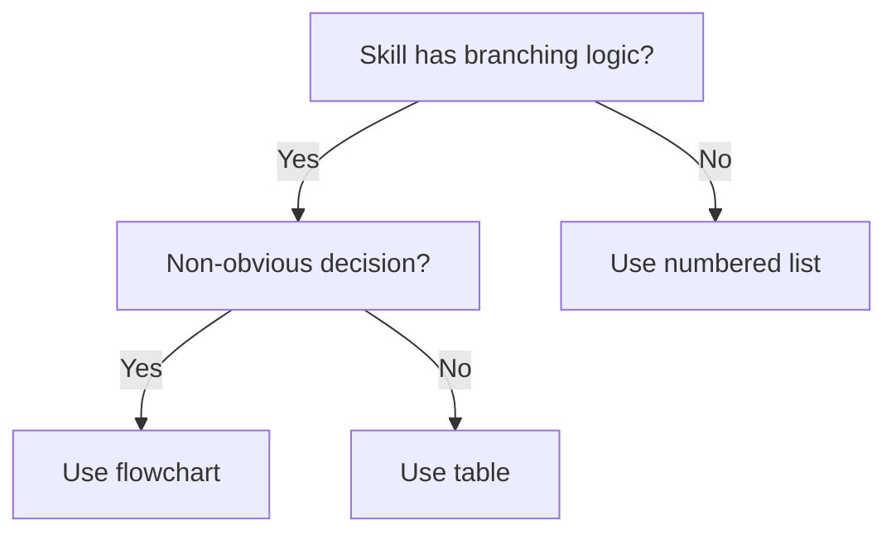

# Skill Writing Guide

Comprehensive reference for writing SKILL.md files in a bundle-plugin. Load this when you need detailed conventions for frontmatter, descriptions, body structure, or resource organization.

## Skill Anatomy

```
skill-name/
├── SKILL.md (required)
│   ├── YAML frontmatter (name, description — required)
│   └── Markdown body (instructions, examples, templates)
└── Supporting resources (optional)
    ├── scripts/    — Deterministic tools the skill invokes
    ├── references/ — Docs loaded into context on demand
    └── assets/     — Templates, icons, config files used in output
```

## Frontmatter Fields

### Required Fields

| Field | Rules |
|-------|-------|
| `name` | Kebab-case identifier matching the directory name. Letters, numbers, hyphens only. Max 64 characters |
| `description` | See Description Writing section below |

### Optional Fields

| Field | Effect | When to Use |
|-------|--------|-------------|
| `disable-model-invocation: true` | Only the user can invoke via `/name` | Side-effect workflows: deploy, commit, send messages |
| `user-invocable: false` | Hidden from `/` menu, only Claude invokes | Background knowledge that isn't a user action |
| `allowed-tools` | Pre-approve tools without per-use prompts | Skills that need specific tool access (e.g., `Bash(git *)`) |
| `context: fork` | Run in an isolated subagent context | Self-contained tasks that shouldn't consume main context |
| `agent` | Which subagent type to use with `context: fork` | Pair with fork: `Explore` for read-only, `Plan` for planning |
| `argument-hint` | Shown during autocomplete (e.g., `[issue-number]`) | Skills that take arguments |
| `model` | Override the session model | Specialized tasks needing a specific model |
| `effort` | Override reasoning effort (`low`/`medium`/`high`/`max`) | Tasks needing more or less reasoning depth |
| `paths` | Glob patterns limiting when skill auto-activates | Skills tied to specific file types or directories |
| `hooks` | Lifecycle hooks scoped to the skill (Claude Code only) | Pre/post validation when the skill runs. See below. |
| `shell` | `bash` (default) or `powershell` for inline commands | Windows-specific skills |

**Example combining fields:**

```yaml
---
name: deploy
description: "Use when deploying the application to production"
disable-model-invocation: true
allowed-tools: Bash(git *) Bash(npm *)
context: fork
argument-hint: "[environment]"
---
```

### Frontmatter Hooks (Claude Code Only)

> This feature is **only available on Claude Code**. Cursor, Codex, OpenCode, and Gemini do not support frontmatter hooks.

Skills can define hooks directly in YAML frontmatter. These hooks are scoped to the skill's lifecycle — active when the skill is invoked, automatically cleaned up when it finishes. All hook events are supported.

```yaml
---
name: secure-deploy
description: "Use when deploying with security validation"
hooks:
  PreToolUse:
    - matcher: "Bash"
      hooks:
        - type: command
          command: "${CLAUDE_SKILL_DIR}/scripts/validate-command.sh"
  Stop:
    - hooks:
        - type: prompt
          prompt: "Review whether all security checks passed: $ARGUMENTS"
          once: true
---
```

The `once: true` field makes a hook run only once per session (useful for one-time post-completion checks). Four handler types are available: `command`, `http`, `prompt`, and `agent`. See `skills/scaffolding/references/platform-adapters.md` for the full field reference.

**Cross-platform consideration:** If your bundle-plugin targets multiple platforms, avoid frontmatter hooks in skills that need to work on non-Claude Code platforms. Instead, use `hooks/hooks.json` for session-level hooks.

### Invocation Control Matrix

| Frontmatter | You can invoke | Claude can invoke | When loaded into context |
|-------------|---------------|-------------------|------------------------|
| (default) | Yes | Yes | Description always in context, full skill loads when invoked |
| `disable-model-invocation: true` | Yes | No | Description not in context, full skill loads when you invoke |
| `user-invocable: false` | No | Yes | Description always in context, full skill loads when invoked |

## String Substitutions

Skills support dynamic value substitution in the body content:

| Variable | Description |
|----------|-------------|
| `$ARGUMENTS` | All arguments passed when invoking the skill. If not present in content, arguments are appended as `ARGUMENTS: <args>` |
| `$ARGUMENTS[N]` | Access a specific argument by 0-based index (e.g., `$ARGUMENTS[0]` for the first) |
| `$N` | Shorthand for `$ARGUMENTS[N]` (e.g., `$0` for first, `$1` for second) |
| `${CLAUDE_SESSION_ID}` | Current session ID — useful for logging, session-specific files |
| `${CLAUDE_SKILL_DIR}` | Directory containing the skill's SKILL.md — use to reference bundled scripts regardless of cwd |

Indexed arguments use shell-style quoting: `/my-skill "hello world" second` makes `$0` = `hello world`, `$1` = `second`.

**Example:**

```yaml
---
name: fix-issue
description: "Use when fixing a GitHub issue by number"
disable-model-invocation: true
---

Fix GitHub issue $ARGUMENTS following our coding standards.
Run the validation script: `python ${CLAUDE_SKILL_DIR}/scripts/validate.py`
```

## Dynamic Context Injection

The `` !` `` syntax runs shell commands before the skill content is sent to the agent. The command output replaces the placeholder — the agent receives actual data, not the command.

**Inline form:**

```markdown
- PR diff: !`gh pr diff`
- Changed files: !`gh pr diff --name-only`
```

**Multi-line form** (fenced code block opened with `` ```! ``):

````markdown
```!
node --version
npm --version
git status --short
```
````

This is preprocessing — the agent only sees the final result. Use this for injecting environment data, git state, or API responses into the skill context at load time.

## Skill Content Lifecycle

Understanding how skills persist in conversation helps write effective content:

1. **Load once** — When invoked, the rendered SKILL.md enters the conversation as a single message and stays for the rest of the session. Claude Code does not re-read the skill file on later turns
2. **Write standing instructions** — guidance that should apply throughout a task needs to be written as standing instructions, not one-time steps
3. **Auto-compaction** — when context fills up, Claude Code re-attaches the most recent invocation of each skill, keeping the first 5,000 tokens of each. Total budget across all re-attached skills: 25,000 tokens
4. **Re-invocation** — if a skill stops influencing behavior after compaction, the user can re-invoke it to restore full content

**Design implications:**
- Front-load the most critical instructions — they survive compaction
- Keep skills under 5,000 tokens for full survivability
- If writing a large skill (approaching the limit), put the core process in the first 5,000 tokens and reference material later

## Description Writing

The description is the **primary triggering mechanism** — it determines whether agents discover and invoke the skill. This is the highest-impact piece of text in any skill.

### Rules and Reasoning

- **Start with "Use when..."** — this framing helps agents match user intent to skill purpose
- **Describe triggering conditions, not workflow** — testing shows that when descriptions summarize a skill's process, agents follow the description as a shortcut instead of reading the full SKILL.md. A description saying "scans structure, checks manifests, scores categories" caused agents to do exactly that sequence from the description alone, skipping the detailed instructions
- **Be slightly pushy** — agents tend to under-trigger skills. Include related scenarios, edge cases, and alternative phrasings. If there's even a chance the skill applies, the description should hint at it
- **Keep under 250 characters** — descriptions over 250 are truncated in the skill listing, losing trigger keywords
- **Scope appropriately** — if the skill is for bundle-plugins specifically, say so. Don't let the description match unrelated contexts

### Examples

```yaml
# BAD: Summarizes workflow — agent shortcuts to this
description: "Scans project structure, validates manifests, checks version sync, scores 10 categories, generates report"

# BAD: Too vague — triggers on unrelated contexts
description: "Use when auditing any project for quality"

# GOOD: Triggering conditions, properly scoped, pushy
description: "Use when reviewing a bundle-plugin for structural issues, version drift, manifest problems, or skill quality, before releasing a bundle-plugin, or when a user points to a skill folder to review"
```

### Keyword Coverage

Beyond the description, plant searchable keywords throughout the skill body — especially in the Overview and Common Mistakes sections. Agents scan for terms matching the user's problem, so include:

- **Error messages and symptoms** — the exact strings or conditions users encounter (e.g., "version drift", "manifest mismatch", "install failure")
- **Synonyms** — different words for the same concept (e.g., "token budget / context limit / line count")
- **Tool and command names** — actual CLI commands, script names, and file types the skill involves

The goal is to increase the chance that an agent searching for a specific problem lands on this skill. This complements the description — keywords in the body help after the skill is loaded, ensuring the agent finds the relevant section quickly.

## Skill Types

Skills generally fall into two categories:

- **Rigid skills** (discipline-enforcing) — Follow exactly, no improvisation. Examples: security scanning, release checklists, TDD loops
- **Flexible skills** (pattern-based) — Adapt principles to context. Examples: brainstorming, optimization, design interviews
- **Hybrid** — Process is rigid (follow the steps), content decisions are flexible (adapt to context). Examples: authoring, scaffolding

Declare the skill type in the Overview section so the agent knows whether to follow instructions literally or adapt them.

### Content Category (Orthogonal to Execution Discipline)

Skills also vary by what they contain. This axis is independent of rigid/flexible/hybrid and affects how you write the body:

- **Technique** — A concrete method with steps. Write with before/after code comparisons and at least one end-to-end example.
- **Pattern** — A mental model or heuristic. Write with recognition scenarios (when to apply) and counter-examples (when NOT to apply).
- **Reference** — API docs, syntax guides, tool documentation. Write with quick-lookup tables sorted by usage frequency.

The two axes combine:

| | Technique | Pattern | Reference |
|---|---|---|---|
| **Rigid** | TDD loop, release checklist | (rare) | Security scanning rules |
| **Flexible** | Brainstorming methods | Design heuristics | API exploration guide |
| **Hybrid** | Authoring flow | Optimization diagnosis | Platform adapter guide |

Declare both axes in the Overview when it helps the agent understand how to read the skill — e.g., "Skill type: Hybrid technique."

## Instruction Style

### Explain the Why

Today's LLMs respond better to understanding reasoning than to rigid directives. If you find yourself writing MUST or ALWAYS in all caps, reframe: explain the reasoning so the agent understands why it matters.

Exception: absolute directives remain appropriate for safety boundaries — security scanning gates, version sync checks, and release pipeline controls where non-compliance is unrecoverable.

```markdown
# Less effective — rigid rule without reasoning
You MUST ALWAYS check version drift before releasing. NEVER skip this step.

# More effective — explains why, agent understands the stakes
Check version drift before releasing — a single drifted manifest can cause install
failures on specific platforms, and users won't know why the plugin stopped working.
```

### Use the Imperative Form

Skills are instructions, not documentation.

```markdown
# Less effective — passive/descriptive
The project structure should be scanned first.

# More effective — imperative
Scan the project structure first.
```

### Concrete Examples Over Abstract Descriptions

One real example teaches more than three paragraphs of explanation. Include at least one concrete example per key instruction in the skill.

### Defensive Writing (for Rigid/Hybrid Skills)

When a skill enforces discipline (security gates, release checklists, TDD loops), agents under pressure will find creative ways to rationalize non-compliance. Flexible skills should preserve room for judgment — but rigid and hybrid skills need explicit defenses.

**Four patterns:**

1. **Close loopholes explicitly** — Don't just state the rule; forbid specific workarounds:

```markdown
# Weak — leaves room for interpretation
Delete untested code. Start over.

# Stronger — closes specific workarounds
Delete untested code. Start over.
- Don't keep it as "reference"
- Don't "adapt" it while rewriting
- Delete means delete
```

2. **Rationalization table** — Collect excuses agents actually produce (from behavioral testing or experience) and counter each one:

```markdown
| Excuse | Reality |
|--------|---------|
| "Too simple to test" | Simple code breaks. Test takes 30 seconds. |
| "I'll test after" | Tests passing after the fact prove nothing about design intent. |
```

3. **Red-flag checklist** — Give agents a self-check list of warning signs that they're about to rationalize:

```markdown
## Red Flags — STOP and Reconsider
- Skipping a step "just this once"
- "This is different because..."
- "The spirit of the rule is..."
```

4. **"Letter = spirit" declaration** — Cut off the entire class of "I'm following the spirit, not the letter" arguments with an early statement: *"Violating the letter of the rules is violating the spirit of the rules."*

## Body Structure

### How Agents Read Skills

Agents process skills in a predictable sequence — optimize your content for this flow:

1. **Description match** — agent reads the description (always in context) and decides whether to load the skill
2. **Overview scan** — after loading, agent reads the Overview to confirm relevance and understand the core principle
3. **Process execution** — agent follows the step-by-step instructions, consulting sections as needed
4. **References on demand** — agent loads `references/` files only when a step explicitly directs it to

**Design implications:** Put the most critical triggering keywords in the description. Put the most important behavioral instructions in the first half of the body (before the 5,000-token compaction threshold). Put heavy reference material in `references/` files, loaded only when specific steps need them.

### Section Order

A well-structured SKILL.md typically includes:

1. **Overview** — What the skill does, core principle, skill type (1-3 sentences)
2. **Entry Detection** (if multiple paths) — Table mapping context to execution path
3. **The Process / Instructions** — Step-by-step guidance in imperative form
4. **Common Mistakes** — Table of pitfalls and fixes (at least 3 entries)
5. **Inputs / Outputs** — Artifact IDs consumed and produced (backtick-wrapped)
6. **Integration** — Called by, Calls, Pairs with — using `project:skill-name` cross-reference format

### Visualizing Decision Points

Use flowcharts or decision trees when the skill has non-obvious branching logic. Don't use them for everything — most content is better served by other formats.

**Use flowcharts for:**
- Non-obvious decision points (choosing between paths based on context)
- Process loops where the agent might stop too early
- "When to use A vs B" decisions

**Don't use flowcharts for:**
- Linear instructions → numbered lists
- Reference material → tables
- Code examples → fenced code blocks

**Recommended formats:** Mermaid (broad rendering support across platforms) or ASCII decision trees (zero dependencies). Keep diagrams small — 5-10 nodes maximum.



## Token Efficiency

Every token in a frequently-loaded skill costs context budget across every session.

| Target | Line Budget | Word Budget |
|--------|-------------|-------------|
| Bootstrap skill (always loaded) | < 200 lines | < 150 words |
| Regular skill body | < 500 lines | < 500 words |
| Description (always in context) | — | < 250 characters |
| Total frontmatter | — | < 1024 characters |

Use whichever metric is easier to check — the core principle is that the body's first ~5,000 tokens must contain all critical instructions (the compaction survival threshold).

**Techniques for staying lean:**
- Cross-reference other skills (`project:skill-name`) instead of repeating content
- One excellent example beats three mediocre ones
- Extract heavy reference content (100+ lines) to `references/` files
- Don't include information the agent already knows (standard tool usage, basic git commands)

## Behavioral Verification

Static auditing (`audit_skill.py`) checks structural compliance — frontmatter format, line counts, broken references. It cannot verify that agents actually follow the skill's instructions as intended.

For high-stakes skills (especially rigid and hybrid types), consider testing with subagents before delivery:

1. **Baseline** — run a pressure scenario with a subagent that does NOT have the skill loaded. Document how the agent behaves naturally — what shortcuts it takes, what rationalizations it offers
2. **With-skill** — run the same scenario with the skill loaded. Verify the agent now follows the instructions correctly
3. **Loophole discovery** — if the agent finds new ways to rationalize non-compliance, update the skill to close those gaps

A common failure mode: descriptions that summarize the skill's workflow cause agents to follow the description as a shortcut, skipping the full body. If your baseline test reveals this, rewrite the description to contain only triggering conditions.

This is a recommended practice, not a required step. Apply it when the cost of agent non-compliance is high — release pipelines, security gates, and discipline-enforcing processes where "close enough" isn't acceptable.

## Progressive Disclosure

The three-level loading system keeps context budgets manageable:

| Level | When Loaded | What Goes Here |
|-------|-------------|----------------|
| Metadata (name + description) | Always | Triggering conditions only (~100 words) |
| SKILL.md body | When skill triggers | Core instructions, process, examples |
| references/, scripts/, assets/ | On demand | Heavy docs, executable tools, templates |

When the SKILL.md body approaches 500 lines, extract:
- API reference tables → `references/`
- Platform-specific details → one file per platform under `references/`
- Long example templates → `assets/`

Reference extracted files clearly with guidance on when to read them:

```markdown
For platform-specific wiring details, read the relevant file
under references/ and then load the template files from assets/.
```

## Nested Directory Discovery

Claude Code automatically discovers skills from nested `.claude/skills/` directories. If you're working in `packages/frontend/`, Claude Code also looks for skills in `packages/frontend/.claude/skills/`. This supports monorepo setups where packages have their own skills.

The `paths` frontmatter field works with this: it limits auto-activation to files matching the glob patterns, so a skill in a monorepo package only activates when working with that package's files.

## Supporting Resources

### When to Create References

Create a `references/` file when:
- A section exceeds 100 lines and isn't needed on every invocation
- Content is domain-specific (platform docs, API specs) and only relevant in certain branches
- Multiple skills share the same reference material

### When to Create Scripts

Create a `scripts/` file when:
- Multiple test runs independently produce similar helper scripts
- A task is deterministic and repetitive (JSON validation, file scanning, version bumping)
- The skill needs to produce consistent, programmatic output

### When to Create Assets

Create an `assets/` file when:
- The skill generates files from templates (config files, manifest boilerplate)
- Output requires specific formatting that's easier to template than describe

## External Tool References (MCP / CLI)

When a skill needs to invoke external tools or services, follow the decision tree in `skills/scaffolding/references/external-integration.md` to choose between CLI and MCP.

### Declaring CLI Tools

Use `allowed-tools` in frontmatter to pre-approve CLI tool access:

```yaml
allowed-tools: Bash(bin/my-tool *) Python(scripts/validate.py *)
```

### Declaring MCP Tools

MCP tools follow the naming convention `mcp__<server-name>__<tool-name>`. Declare them in `allowed-tools`:

```yaml
allowed-tools: mcp__sentry__get_issues mcp__github__create_pr
```

### Fallback Pattern

When a skill depends on an MCP server that may not be available (not all users will have it configured), include a fallback:

```markdown
Query open issues using the Sentry MCP tools.

**If MCP server `sentry` is unavailable:** Ask the user to provide the
error details manually, or check if they have the Sentry CLI installed
as an alternative.
```

### User Configuration References (`userConfig`)

> **Claude Code only.** Other platforms do not support `userConfig`.

When a plugin declares `userConfig` in `plugin.json`, skills can reference non-sensitive configuration values using the `${user_config.KEY}` substitution syntax:

```markdown
Connect to the API at `${user_config.api_endpoint}` to fetch project data.
```

**Non-sensitive values** (`sensitive: false`) can be referenced directly in skill and agent content via `${user_config.KEY}`. They are also available as `CLAUDE_PLUGIN_OPTION_<KEY>` environment variables in scripts.

**Sensitive values** (`sensitive: true`) cannot be referenced in skill/agent content — they are only available in MCP/LSP/hook configs via `${user_config.KEY}` and in scripts via the `CLAUDE_PLUGIN_OPTION_<KEY>` environment variable. This prevents secrets from appearing in conversation context.

```yaml
# In a skill that uses an MCP server backed by userConfig:
allowed-tools: mcp__my-api__query

# The MCP server's env gets the sensitive token via plugin.json:
# "env": { "API_TOKEN": "${user_config.api_token}" }
```

For the full `userConfig` schema and wiring guide, see `skills/scaffolding/references/external-integration.md`.

### When to Reference What

| Need | Use | Declare in |
|------|-----|------------|
| Stateless tool (lint, format, transform) | CLI via `bin/` or `scripts/` | `allowed-tools: Bash(...)` or `Python(...)` |
| Authenticated external service | MCP server | `allowed-tools: mcp__server__tool` + fallback |
| npm-distributed tool with rich API | MCP stdio via npx | `.mcp.json` + `allowed-tools` |
| Simple data fetch | CLI (`curl` equivalent or custom script) | `allowed-tools: Bash(...)` |
| User-provided API endpoint (non-secret) | `${user_config.KEY}` in skill body | `userConfig` in `plugin.json` |
| User-provided API token (secret) | MCP env + `userConfig` | `userConfig` with `sensitive: true` |
